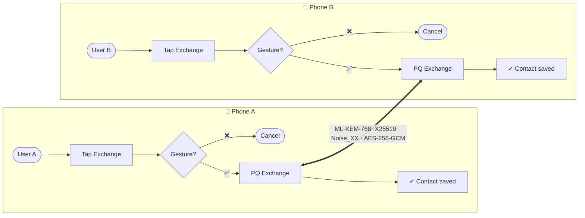

<div align="center">

# ✦ AURA ✦

### Gesture-authenticated offline contact exchange for Android

*Two phones. One gesture. Local-first. Post-quantum.*

[](https://github.com/showerideas/Aura/actions/workflows/ci.yml)
[](https://github.com/showerideas/Aura/releases/latest)
[](https://github.com/showerideas/Aura/releases/latest)
[](LICENSE)
[](https://developer.android.com/about/versions/oreo)
[](https://developer.android.com/about/versions/15)
[](https://kotlinlang.org/)
[](docs/SECURITY.md)
[](docs/SECURITY.md)

</div>

---

## What is AURA?

**AURA** lets two people swap contact cards face-to-face — **no internet, no QR scan, no NFC tap required**. Set up your profile once, record a personal unlock gesture (or bind it to your fingerprint), then open the app and tap Exchange. The exchange flies over a direct Bluetooth-LE / Wi-Fi-P2P / NFC link protected by a post-quantum hybrid KEM (ML-KEM-768+X25519) and ML-DSA-65 identity signatures. When the exchange completes a success sheet appears showing the received contact; tap it for full detail or close to return home. Every exchange you have ever made is browsable in the History tab of your Contacts screen.

> **BLE/Wi-Fi-P2P exchange is fully offline** — no account, no cloud sync, nothing for a server to leak. The optional QR relay path uses a short-lived relay slot (HTTPS, AES-256-GCM ciphertext only) for environments where direct radio contact is unavailable; the relay never sees plaintext.

<div align="center">

```text
  📱  open app → tap Exchange  →  ✋ gesture  →  🔐 PQ-KEM  →  📇  📱
```

</div>

---

## ⚡ Front desk

| | |
|---|---|
| 📥 **Install** | [`Releases → latest`](https://github.com/showerideas/Aura/releases/latest) — side-load the APK |
| 📖 **Docs hub** | [`/docs`](docs/README.md) — engineering record |
| 🏛 **Architecture** | [`docs/ARCHITECTURE.md`](docs/ARCHITECTURE.md) |
| 🔐 **Security model** | [`docs/SECURITY.md`](docs/SECURITY.md) |
| 🔄 **Exchange flow** | [`docs/EXCHANGE_FLOW.md`](docs/EXCHANGE_FLOW.md) |
| 🔌 **Wire protocol** | [`docs/WIRE_PROTOCOL.md`](docs/WIRE_PROTOCOL.md) — v9 frame spec |
| ✋ **Gesture auth** | [`docs/GESTURE_AUTH.md`](docs/GESTURE_AUTH.md) |
| 🧪 **Audit** | [`docs/AUDIT.md`](docs/AUDIT.md) |
| 🛠 **Build locally** | [`docs/BUILD.md`](docs/BUILD.md) |
| 📜 **Privacy policy** | [`PRIVACY_POLICY.md`](PRIVACY_POLICY.md) |
| 📜 **License** | [MIT](LICENSE) |

---

## ✨ Feature set — v5.6

| 🔐 Post-quantum crypto | 🌐 Transport | 🎯 Auth & UX |
|---|---|---|
| Hybrid KEM ML-KEM-768+X25519 | Nearby Connections (GMS) | MediaPipe gesture gate |
| ML-DSA-65 identity signatures | Wi-Fi Direct (FOSS/F-Droid) | Temporal liveness (2-layer) |
| PQXDH full prekey bundle | BLE GATT MTU 517 + SCI | Biometric unlock fallback |
| Noise_XX encrypted channel | NFC HCE ISO 7816-4 | Behavioral continuous auth |
| Double Ratchet + SPQR | QR relay (HTTPS + OHTTP) | SAS first-meet PIN |
| MLS group key agreement | QUIC/HTTP3 (Cronet) | Multi-profile Personal/Work |
| Sealed sender envelopes | Tor SOCKS5 (Orbot) | Room mode (star topology) |
| SPKI certificate pinning | LoRa via Meshtastic (opt-in) | Wear OS 7 Glance tile |

| 🪪 Identity & privacy | 📊 Enterprise & analytics | 🧪 Quality |
|---|---|---|
| W3C Verifiable Credentials | 6 MDM restriction keys | 75 unit test files |
| ISO 18013-5 mdoc/mDL | Zero-touch enrollment | 16 instrumented test files |
| OpenID4VP presentation | Advanced Protection API | 36 iOS AuraCore tests |
| PSI contact discovery | Differential privacy ε=1.0 | JaCoCo 60% branch floor |
| did:key identity anchors | Signed audit export CSV | TalkBack + AA contrast pass |
| StrongBox key migration | Android Auto voice gate | 365 strings × 7 locales |
| Replay + nonce dedup window | Wear OS Health Connect HRV | F-Droid reproducible build |
| Exchange history tab | PDF analytics export | vCard / Contacts export |

---

## 🔄 How it works



The full step-by-step sequence (PQ-KEM handshake, ML-DSA-65 identity proof, Noise_XX channel, replay window, avatar streaming, SAS verification) is in [`docs/EXCHANGE_FLOW.md`](docs/EXCHANGE_FLOW.md).

---

## 🧱 Architecture at a glance

| Layer | Components |
|---|---|
| 🎨 **UI** (14 screens) | Home · Profile · Exchange+SuccessSheet · Contacts+History · QR · Room · Settings · Audit · GestureLibrary |
| ⚙️ **Services** | NearbyExchangeService · AuraHceService (NFC) · AuraQsTileService |
| 🎯 **Auth** | GestureAuthManager · DualBoneGraphTracker · TemporalGestureClassifier · LivenessGuard · BiometricAuthHelper · ContinuousAuthMonitor |
| 🔐 **Crypto** | HybridKEM (ML-KEM-768+X25519) · HybridIdentityKey (ML-DSA-65+ECDSA) · NoiseChannel (Noise_XX) · DoubleRatchet+SPQR · PQXDH · MlsGroupState (RFC 9420) · SealedEnvelope |
| 🪪 **Identity** | VcIssuer (did:key · did:peer:2) · MdocDocument (ISO 18013-5/7) · VpBuilder (OpenID4VP) · DIDCommTransport · DidResolver |
| 🌐 **Network** | RelayClient · ObliviousHttpClient (OHTTP) · QuicRelayClient (HTTP/3) · TorRelayManager · PrivacyPassClient |
| 🔬 **ZK / FIDO / AR** | GestureZkProver (Groth16) · AuraCredentialProviderService · PasskeyRepository · ArExchangeCoordinator · SpatialContactCard |
| 🏢 **Enterprise** | EnterprisePolicy · AuditExportWorker · ShamirSecretSharing · AuditSigningCoordinator (MPC 2-of-3) |
| 💾 **Data** — Room v12 | ContactDao · ProfileDao · BlockedEndpointDao · KnownPeerDao · ExchangeAuditDao · PasskeyDao · SharePresetDao |

Full detail (package map, dependency rules, threading) in [`docs/ARCHITECTURE.md`](docs/ARCHITECTURE.md).

---

## 📱 Platform targets

| Platform | Status | Notes |
|---|---|---|
| **Android phone** | Production | Min SDK 26, Target 35 — 168 Kotlin source files |
| **Wear OS 7** | Production | Glance tile (`AuraWearTileService`), Health Connect HRV |
| **Android Auto** | Production | Voice action, biometric gate, full screen library |
| **iOS companion** | Production | AuraCore — ContactProfile, SasVerifier, WireProtocol.swift, MultipeerTransport |
| **Desktop (KMP)** | Production | Kotlin Multiplatform — QR relay transport companion |

---

## 🧰 Tech stack

| Layer | Choice |
|---|---|
| Language | **Kotlin 2.0** (JVM 17) |
| UI | Fragments + ViewBinding + Navigation Component + Material 3 |
| DI | Hilt 2.51.1 |
| Persistence | Room v11 (11 schema versions, exported schemas) |
| Async | Kotlinx Coroutines 1.8.1 |
| Primary transport (GMS) | Google **Nearby Connections** 19.1.0 |
| FOSS transport | Wi-Fi Direct (NSD/mDNS) + BLE GATT |
| Additional transports | NFC HCE (ISO 7816-4) · LoRa · UWB (FiRa 3.0) |
| Session crypto | **ML-KEM-768 + X25519** hybrid KEM (BouncyCastle bcpqc-jdk18on) |
| Identity crypto | **ML-DSA-65 + ECDSA P-256** hybrid — Android Keystore |
| Protocol crypto | PQXDH · Noise_XX · MLS RFC 9420 · Double Ratchet + SPQR · AES-256-GCM |
| Gesture auth | CameraX + **MediaPipe GestureRecognizer** (21 landmarks, 63-float embedding) + temporal liveness |
| Biometric | `androidx.biometric` (fingerprint / face) + `CryptoObject` KeyAgreement (API 36+) |
| QR | ZXing-embedded 4.3.0 |
| Preferences | DataStore 1.1.1 + `EncryptedSharedPreferences` |
| Build | AGP 8.13.2 (Kotlin DSL) + Version Catalogs |
| Min / Target SDK | **26** / **35** |
| Platforms | Android · Wear OS 7 · Android Auto · iOS (AuraCore) · Desktop (KMP) |
| CI | GitHub Actions — unit tests + JaCoCo (60% branch floor) + Lint + `assembleRelease` + APK size gate |

---

## 🔐 Cryptographic stack

| Layer | Primitive | Standard |
|---|---|---|
| Session key agreement | ML-KEM-768 + X25519 hybrid KEM | FIPS 203 + RFC 7748 |
| Shared secret derivation | HKDF-SHA256 over `mlkem_ss ‖ x25519_ss` | RFC 5869 |
| Identity signatures | ML-DSA-65 + ECDSA P-256 hybrid | FIPS 204 + NIST P-256 |
| Channel encryption | AES-256-GCM | NIST SP 800-38D |
| Noise channel | Noise_XX (X25519, AESGCM, SHA256) | Noise Protocol Framework |
| Async key exchange | PQXDH prekey bundle | Signal PQ extension |
| Session ratchet | Double Ratchet + SPQR post-quantum ratchet | DR spec |
| Group key agreement | MLS RFC 9420 | RFC 9420 |
| SAS verification | SHA-256(shared\_secret) mod 10⁶, 6 digits | — |
| Sealed sender | HKDF + AES-256-GCM two-phase unwrap | Signal sealed sender |
| Key storage | Android Keystore (StrongBox preferred) | Android Security |
| Gesture template | `EncryptedSharedPreferences` (AES-256 master key) | Jetpack Security |

Full wire frame specification (frame structure, key sizes, version history v1–v9) in [`docs/WIRE_PROTOCOL.md`](docs/WIRE_PROTOCOL.md).

---

## 🚀 Get started in 60 seconds

1. **Install** the APK from [Releases](https://github.com/showerideas/Aura/releases/latest) (enable *Install unknown apps* for your browser/file-manager first).
2. **Set up your profile** — name, phone, email, company, title, website, bio, avatar.
3. **Record your gesture** — hold the record button, perform your chosen hand pose once. Or bind unlock to your fingerprint instead.
4. **Activate** — open AURA and tap the Exchange button. Both phones need to be in the Exchange screen simultaneously.
5. **Perform your gesture.** Done — the other person's card appears in a success sheet. Tap it for full detail, or close to return home. All past exchanges live in the **History** tab of your Contacts screen.

Want to build from source? → [`docs/BUILD.md`](docs/BUILD.md).

---

## 🛡 Security in one paragraph

Each exchange opens a **fresh post-quantum hybrid KEM** (ML-KEM-768+X25519), derives a 256-bit AES key via HKDF-SHA256, and wraps the profile JSON in **AES-GCM** before the bytes leave the device. A long-lived **hybrid identity key** (P-256 + ML-DSA-65 FIPS 204) signs every payload; an adversary must break both classical and post-quantum signatures to forge identity. The session is wrapped in a **Noise_XX encrypted channel**. Replay attempts are rejected by a **timestamp + per-nonce dedup window**. Blocked endpoints are remembered as identity-key hashes in Room. For first-meet exchanges, `SasVerifier` produces a 6-digit Short Authentication String both parties compare verbally. Multi-party Room sessions use **MLS RFC 9420 group key agreement**. Full threat model in [`docs/SECURITY.md`](docs/SECURITY.md).

---

## 🗺 Roadmap

- [x] **v1.0.0** — gesture gate (MediaPipe), ECDH+HKDF, room exchange, QR fallback, blocklist, replay protection, biometric, accessibility, settings, R8-shrunk release APK
- [x] **v1.1.0** — QR relay, 7 locales (HI, ES, FR, DE, JA, KO, ZH-CN), 259 unit + 51 instrumented tests
- [x] **v2.0.0** — transport abstraction, NFC HCE ISO 7816-4, multi-profile, identity rotation, audit log, SPKI pinning, encrypted backup
- [x] **v3.0.0** — iOS AuraCore companion, Wear OS pairing, Android Auto voice + biometric gate, F-Droid reproducible build
- [x] **v3.3.0** — full transport stack (BLE GATT, Wi-Fi Direct FOSS, NFC, LoRa opt-in), PQ crypto (ML-KEM-768, ML-DSA-65, PQXDH), differential privacy analytics, enterprise MDM, JaCoCo 60% floor
- [x] **v4.0.0** — Noise_XX channel, MLS RFC 9420 rooms, Double Ratchet + SPQR, OHTTP RFC 9458, QUIC/HTTP3, OpenID4VP, ISO 18013-5 mdoc, W3C Verifiable Credentials, UWB FiRa 3.0, BLE Channel Sounding, Advanced Protection API; exchange success sheet; contacts history tab
- [x] **v5.6** — dual-descriptor gesture enrollment, Android 17 ML-DSA-65 native Keystore, FIDO2 CredentialProvider + NFC CTAP2 relay, ZK-SNARK Groth16 gesture privacy, ARCore UWB-gated contact card, DIDComm v2 + ISO 18013-7, MPC 2-of-3 threshold audit signing, Privacy Pass relay rate-limiting, `did:peer:2` + `DidResolver`, ML Kit OCR business card import
- [ ] **R&D pipeline** — satellite fallback (SatelliteManager), Matter/Thread IoT identity bridge, Android 17 contact picker integration, Kotlin 2.2 Swift export

---

## 🤝 Contributing

Pull requests welcome. Please read [`docs/CONTRIBUTING.md`](docs/CONTRIBUTING.md) before opening one — it covers branch naming, the per-PR commit style this repo uses, and the test gates each PR must pass.

---

## 📜 License

MIT — see [`LICENSE`](LICENSE).
