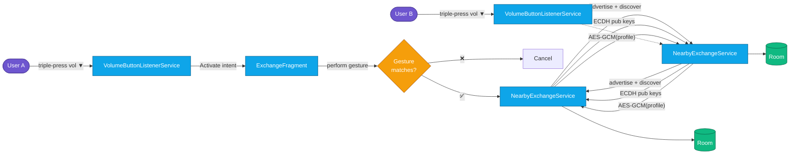
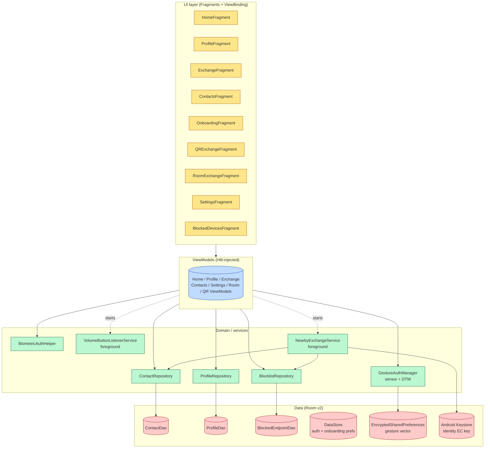

<div align="center">

# ✦ AURA ✦

### Gesture-authenticated offline contact exchange for Android

*Two phones. One gesture. Zero servers.*

[](https://github.com/showerideas/Aura/actions/workflows/ci.yml)
[](https://github.com/showerideas/Aura/releases/latest)
[](#license)
[-3DDC84?logo=android&logoColor=white)](https://developer.android.com/about/versions/oreo)
[-3DDC84?logo=android&logoColor=white)](https://developer.android.com/about/versions/15)
[](https://kotlinlang.org/)
[](docs/SECURITY.md)

</div>

---

## What is AURA?

**AURA** lets two people swap contact cards face-to-face — **no internet, no QR code, no NFC tap required**. You set up your profile once, record a personal unlock gesture (or bind it to your fingerprint), and from then on a single motion is enough to push your details to the phone in front of you. The exchange flies over a direct Bluetooth-LE / Wi-Fi-P2P link encrypted end-to-end with ECDH + AES-256-GCM.

> AURA has **no backend**. There is nothing to sign up for, nothing to sync, and nothing for a server operator to leak — because there is no server operator.

<div align="center">

```
   📱  ─── triple-press vol ▼ ──▶  ✋ gesture  ──▶  🔐 ECDH  ──▶  📇  📱
```

</div>

---

## ⚡ Quick links

| | |
|---|---|
| 📥 **Get the APK** | [Latest release](https://github.com/showerideas/Aura/releases/latest) |
| 📖 **Read the docs** | [`/docs`](docs/README.md) — architecture, security, every feature |
| 🧭 **Architecture diagrams** | [`docs/ARCHITECTURE.md`](docs/ARCHITECTURE.md) |
| 🔐 **Security model** | [`docs/SECURITY.md`](docs/SECURITY.md) |
| 🧪 **Audit / intent fulfilment** | [`docs/AUDIT.md`](docs/AUDIT.md) |
| 🛠 **Build it yourself** | [`docs/BUILD.md`](docs/BUILD.md) |
| 📜 **Privacy policy** | [`PRIVACY_POLICY.md`](PRIVACY_POLICY.md) |
| 🛍 **Play Store listing** | [`STORE_LISTING.md`](STORE_LISTING.md) |

---

## How it works (in one diagram)



The full sequence — including ECDH key derivation, challenge–response identity proof, replay-counter window, and avatar streaming — lives in [`docs/EXCHANGE_FLOW.md`](docs/EXCHANGE_FLOW.md).

---

## ✨ Feature highlights

<table>
<tr>
<td width="33%" valign="top">

### 🔐 Privacy by construction
- Zero outbound network calls
- No account, no email, no cloud
- ECDH per-session keys
- AES-256-GCM payload encryption
- Android Keystore identity key
- Endpoint blocklist + replay window

</td>
<td width="33%" valign="top">

### 🎯 Frictionless UX
- Triple-press volume ▼ to activate
- Custom gesture **or** biometric unlock
- One-shot Room mode (1 host : N guests)
- QR fallback for BLE-hostile venues
- Avatar streamed alongside profile
- Favourites + private notes per contact

</td>
<td width="33%" valign="top">

### ♿️ Production polish
- Full accessibility audit (TalkBack, large fonts, contrast)
- Onboarding tutorial
- Pulsing-activation animation
- Settings + Blocked Devices screens
- Room schema migrations (`v1 → v2`)
- vCard / contact-book export

</td>
</tr>
</table>

Detailed write-up of every single PR/feature is in [`docs/features/`](docs/features/).

---

## 🧱 Architecture at a glance



---

## 🧰 Tech stack

| Layer | Choice |
|---|---|
| Language | **Kotlin 2.0** (JVM 17) |
| UI | Fragments + ViewBinding + Navigation Component |
| DI | Hilt 2.51 |
| Persistence | Room 2.6 (exported schemas, v2 with migration) |
| Async | Kotlinx Coroutines 1.8 |
| P2P transport | Google **Nearby Connections** |
| Crypto | Android Keystore + ECDH (EC-256) + AES-256-GCM + ECDSA |
| Gesture auth | Accelerometer + **Dynamic Time Warping** matching |
| Biometric | `androidx.biometric` (fingerprint / face) |
| QR | ZXing-embedded 4.3 |
| Preferences | DataStore + `EncryptedSharedPreferences` |
| Build | Gradle 8.4 (Kotlin DSL) + Version Catalogs |
| Min / Target SDK | 26 / 35 |
| CI | GitHub Actions — unit tests + Lint + `assembleRelease` + APK artifact |

---

## 🚀 Get started in 60 seconds

1. **Install** the APK from [Releases](https://github.com/showerideas/Aura/releases/latest).
2. **Set up your profile** — name, phone, email, company, title, website, bio, avatar.
3. **Record your gesture** (hold the record button, perform the move once). You can also bind unlock to your fingerprint instead.
4. **Tap Activate** (or triple-press vol ▼ from anywhere). Both phones light up.
5. **Perform the gesture**. Done — the other person now has your card.

Want to build from source? → [`docs/BUILD.md`](docs/BUILD.md).

---

## 🛡 Security in one paragraph

Each exchange opens a fresh ECDH key pair (never reused), derives a 256-bit AES key, and wraps the profile JSON in AES-GCM before the bytes leave the device. A long-lived Android-Keystore EC key signs a challenge so each side can detect impersonation. Replay attempts are rejected by a monotonically advancing counter window. Blocked endpoints are remembered as fingerprints in Room. The full threat model and crypto walkthrough is in [`docs/SECURITY.md`](docs/SECURITY.md).

---

## 🗺 Roadmap

- [x] Gesture gate, ECDH, room exchange, QR fallback, blocklist, replay protection, biometric, accessibility, settings — see [audit](docs/AUDIT.md)
- [ ] Ship translated `values-xx/` resource bundles (currently scaffolded only)
- [ ] Wire Espresso UI tests into a CI emulator job
- [ ] Signed Play Store build + Play Integrity attestation
- [ ] Cross-platform "AURA Lite" iOS receiver (read-only via QR)

---

## 🤝 Contributing

Pull requests welcome. Please read [`docs/CONTRIBUTING.md`](docs/CONTRIBUTING.md) before opening one — it covers branch naming, the per-PR commit style this repo uses, and the test gates each PR must pass.

---

## License

MIT — see [`LICENSE`](LICENSE) (to be added; the repo is currently under an implicit "all rights reserved" until that file lands).

---

<div align="center">

*Built by [Shower Ideas](https://github.com/showerideas) — privacy-first software for the offline moments that matter.*

</div>
