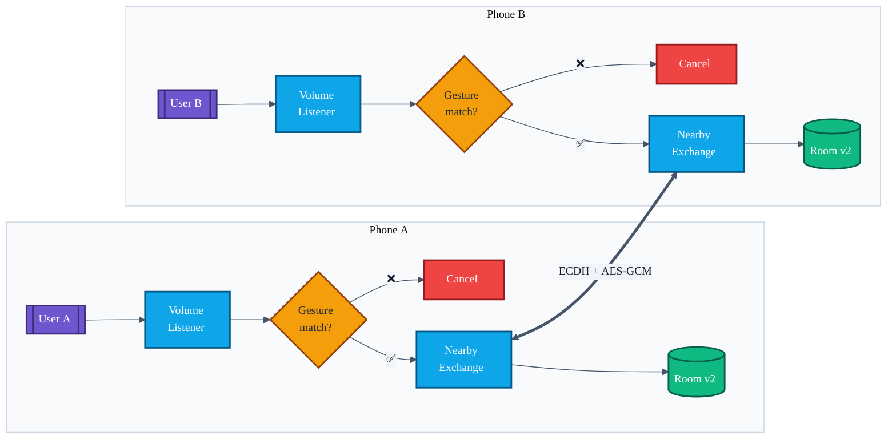
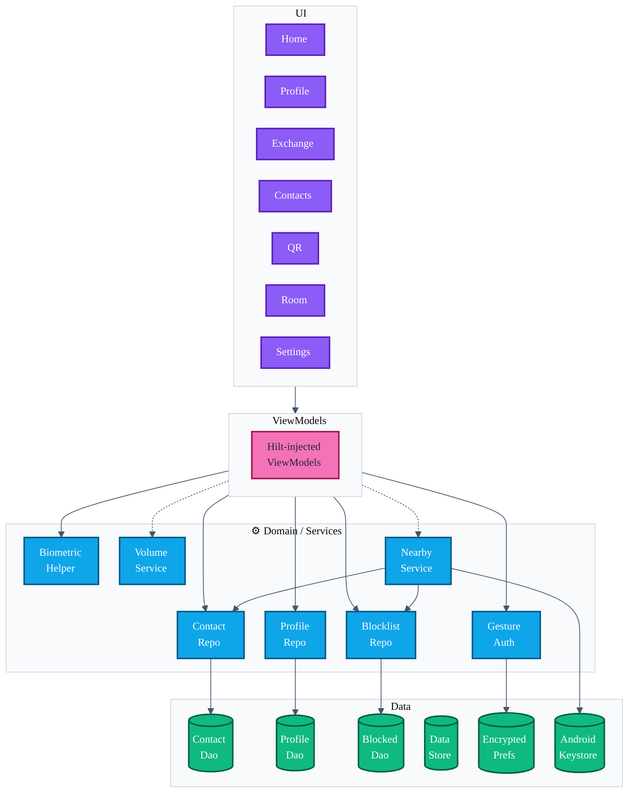

<div align="center">

# ✦ AURA ✦

### Gesture-authenticated offline contact exchange for Android

*Two phones. One gesture. Zero servers.*

[](https://github.com/showerideas/Aura/actions/workflows/ci.yml)
[](https://github.com/showerideas/Aura/releases/latest)
[](https://github.com/showerideas/Aura/releases/latest)
[](LICENSE)
[](https://developer.android.com/about/versions/oreo)
[](https://developer.android.com/about/versions/15)
[](https://kotlinlang.org/)
[](docs/SECURITY.md)

</div>

---

## What is AURA?

**AURA** lets two people swap contact cards face-to-face — **no internet, no QR scan, no NFC tap required**. You set up your profile once, record a personal unlock gesture (or bind it to your fingerprint), and from then on a single motion is enough to push your details to the phone in front of you. The exchange flies over a direct Bluetooth-LE / Wi-Fi-P2P link encrypted end-to-end with ECDH + AES-256-GCM.

> AURA has **no backend**. There is nothing to sign up for, nothing to sync, and nothing for a server operator to leak — because there is no server operator.

<div align="center">

```text
  📱   ── triple-press vol ▼ ──▶   ✋ gesture   ──▶   🔐 ECDH   ──▶   📇   📱
```

</div>

---

## ⚡ Front desk

| | |
|---|---|
| 📥 **Install** | [`Releases → latest`](https://github.com/showerideas/Aura/releases/latest) — side-load the APK |
| 📖 **Docs hub** | [`/docs`](docs/README.md) — engineering record |
| 🏛 **Architecture** | [`docs/ARCHITECTURE.md`](docs/ARCHITECTURE.md) |
| 🔐 **Security model** | [`docs/SECURITY.md`](docs/SECURITY.md) |
| 🔄 **Exchange flow** | [`docs/EXCHANGE_FLOW.md`](docs/EXCHANGE_FLOW.md) |
| ✋ **Gesture auth** | [`docs/GESTURE_AUTH.md`](docs/GESTURE_AUTH.md) |
| 🧪 **Audit** (intent fulfilment) | [`docs/AUDIT.md`](docs/AUDIT.md) |
| 📸 **Showcase** (screenshots + demo) | [`docs/SHOWCASE.md`](docs/SHOWCASE.md) |
| 🛠 **Build locally** | [`docs/BUILD.md`](docs/BUILD.md) |
| 📜 **Privacy policy** | [`PRIVACY_POLICY.md`](PRIVACY_POLICY.md) |
| 🛍 **Play Store copy** | [`STORE_LISTING.md`](STORE_LISTING.md) |
| 📜 **License** | [MIT](LICENSE) |

---

## ✨ Every feature in v1.0.0

> 22 PRs of feature work, each with its own dossier in [`docs/features/`](docs/features/).

| 🔐 Privacy & crypto | 🎯 UX & flow | ♿ Polish & QA |
|---|---|---|
| Zero outbound network | Triple-press vol ▼ wake | Onboarding (3 cards) |
| ECDH P-256 per session | DTW gesture matcher | Permission-rationale sheet |
| AES-256-GCM payloads | Biometric unlock fallback | Pulsing activation animation |
| Android Keystore identity | QR fallback exchange | TalkBack + AA contrast pass |
| Replay-counter window | Room mode (1 host : N) | Settings + Blocked Devices UI |
| Endpoint blocklist | Avatar streamed inline | Localisation scaffolding |
| Device-identity challenge | vCard / Contacts export | Room v1 → v2 migrations |
| No PII ever logged | Favourites + private notes | 32 unit + 4 instrumentation tests |

---

## 🔄 How it works (one diagram)



The full step-by-step sequence (ECDH derivation, challenge–response identity proof, replay window, avatar streaming) is in [`docs/EXCHANGE_FLOW.md`](docs/EXCHANGE_FLOW.md).

---

## 🧱 Architecture at a glance



More detail (package map, dependency direction rules, threading) in [`docs/ARCHITECTURE.md`](docs/ARCHITECTURE.md).

---

## 🧰 Tech stack

| Layer | Choice |
|---|---|
| Language | **Kotlin 2.0** (JVM 17) |
| UI | Fragments + ViewBinding + Navigation Component |
| DI | Hilt 2.51 |
| Persistence | Room 2.6 (exported schemas, v2 + migration) |
| Async | Kotlinx Coroutines 1.8 |
| P2P transport | Google **Nearby Connections** |
| Crypto | Android Keystore + ECDH (P-256) + AES-256-GCM + ECDSA |
| Gesture auth | Accelerometer + **Dynamic Time Warping** |
| Biometric | `androidx.biometric` (fingerprint / face) |
| QR | ZXing-embedded 4.3 |
| Preferences | DataStore + `EncryptedSharedPreferences` |
| Build | Gradle 8.4 (Kotlin DSL) + Version Catalogs |
| Min / Target SDK | **26** / **35** |
| CI | GitHub Actions — unit tests + Lint + `assembleRelease` + APK artifact |

---

## 🚀 Get started in 60 seconds

1. **Install** the APK from [Releases](https://github.com/showerideas/Aura/releases/latest) (enable *Install unknown apps* for your browser/file-manager first).
2. **Set up your profile** — name, phone, email, company, title, website, bio, avatar.
3. **Record your gesture** (hold record, perform the motion once). You can bind unlock to your fingerprint instead.
4. **Activate** — tap the home tile *or* triple-press vol ▼ from anywhere. Both phones light up.
5. **Perform the gesture.** Done — the other person's card is on your phone.

Want to build from source? → [`docs/BUILD.md`](docs/BUILD.md).

---

## 🛡 Security in one paragraph

Each exchange opens a **fresh ECDH key pair** (never reused), derives a 256-bit AES key, and wraps the profile JSON in **AES-GCM** before the bytes leave the device. A long-lived **Android Keystore EC key** signs a challenge so each side can detect impersonation. Replay attempts are rejected by a **monotonically advancing counter window**. Blocked endpoints are remembered as fingerprints in Room. The full threat model lives in [`docs/SECURITY.md`](docs/SECURITY.md).

---

## 🗺 Roadmap

- [x] **v1.0.0** — gesture gate, ECDH, room exchange, QR fallback, blocklist, replay protection, biometric, accessibility, settings, R8-shrunk release APK ([see audit](docs/AUDIT.md))
- [ ] **v1.1.0** — ship 7 translated `values-xx/` bundles (HI, ES, FR, DE, JA, KO, ZH-CN)
- [ ] **v1.2.0** — Espresso + Room-migration tests on a CI emulator runner
- [ ] **v1.3.0** — signed Play Store build + Play Integrity attestation
- [ ] **v2.0.0** — cross-platform "AURA Lite" iOS receiver (read-only via QR)

---

## 🤝 Contributing

Pull requests welcome. Please read [`docs/CONTRIBUTING.md`](docs/CONTRIBUTING.md) before opening one — it covers branch naming, the per-PR commit style this repo uses, and the test gates each PR must pass.

---

## 📜 License

MIT — see [`LICENSE`](LICENSE).
