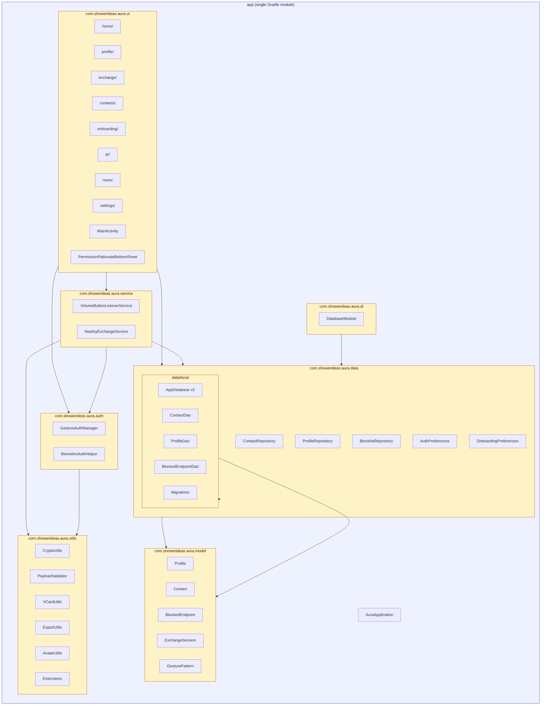
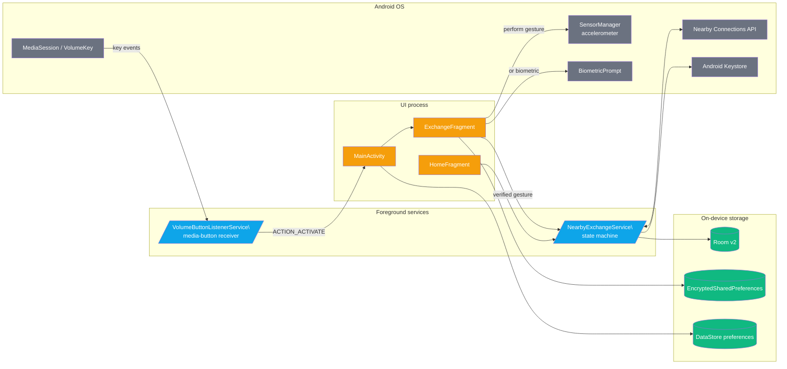
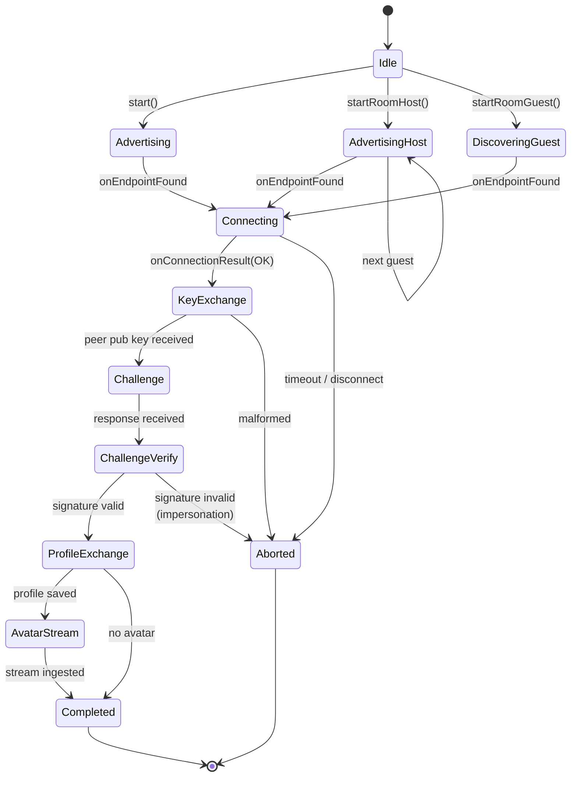
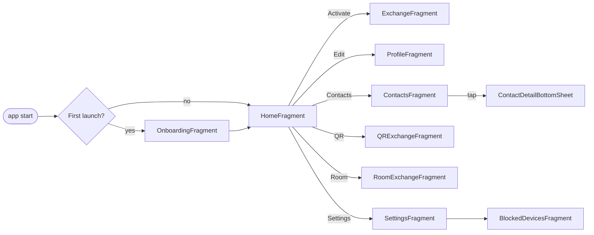

# Architecture

> AURA is a single-module Android app with a strict **UI → ViewModel → Repository → DAO** dependency flow, plus two long-lived foreground services for the hardware-coupled parts (volume-button listener and the Nearby Connections exchange).

---

## 1. Module / package map

### Dependency-direction rules

1. **`ui` may depend on anything below it**, but never on another `ui/*` sub-package directly (use `Navigation`).
2. **`service` does not depend on `ui`** — it talks to `data` and emits events via Intents / `StateFlow`s exposed through repositories.
3. **`data/local` knows nothing about Android UI** and never imports `androidx.fragment` etc.
4. **`utils` is pure-Kotlin / JVM-testable** wherever possible. `CryptoUtils`, `VCardUtils`, `PayloadValidator` are exercised by `app/src/test` unit tests.
5. **`model` has zero outbound deps** — these are plain data classes / Room `@Entity`.

---

## 2. Runtime component diagram

### Why two services?

| Service | Why it must be foreground |
|---|---|
| `VolumeButtonListenerService` | Needs to receive `MediaSession` button events even when AURA is in the background. Without a foreground notification, Android 12+ will reap it within seconds. |
| `NearbyExchangeService` | Holds a BLE / Wi-Fi P2P connection during the exchange; Android requires a `foregroundServiceType="connectedDevice"` to keep BLE active. |

Both services are declared in [`AndroidManifest.xml`](../app/src/main/AndroidManifest.xml) with the right `foregroundServiceType` and request `FOREGROUND_SERVICE_CONNECTED_DEVICE` on API 34+.

---

## 3. Class-level overview of the exchange service

`NearbyExchangeService` is the single largest class (~1 kLOC) and the security-critical hot path. Internally it is a small state machine plus a typed message protocol over the Nearby Connections `Payload` API.

The wire format is one byte of `MSG_TYPE` followed by a body whose shape depends on the type:

| `MSG_TYPE` | Hex | Body |
|---|---|---|
| `PUBLIC_KEY` | `0x01` | SPKI-encoded ephemeral ECDH public key |
| `PROFILE` | `0x02` | `AES-GCM(profile JSON)` (IV ‖ ciphertext ‖ tag) |
| `AVATAR` | `0x03` | Base64(SPKI pub key) `\|` STREAM-payload-id |
| `CHALLENGE` | `0x04` | Base64(SPKI long-lived pub key) `\|` 32-byte nonce |
| `CHALLENGE_RESPONSE` | `0x05` | Base64(SPKI long-lived pub key) `\|` ECDSA signature |

See [`EXCHANGE_FLOW.md`](EXCHANGE_FLOW.md) for the full ordered walkthrough.

---

## 4. Navigation graph

The `nav_graph.xml` lives at [`app/src/main/res/navigation/nav_graph.xml`](../app/src/main/res/navigation/nav_graph.xml).

---

## 5. Dependency injection (Hilt)

A single `DatabaseModule` (`@InstallIn(SingletonComponent::class)`) provides:

- `AppDatabase` (Room) — built with `Migrations.MIGRATION_1_2` registered.
- Each DAO (`ContactDao`, `ProfileDao`, `BlockedEndpointDao`) is provided from the singleton database.
- `GestureAuthManager`, `BiometricAuthHelper`, and the three repositories (`ContactRepository`, `ProfileRepository`, `BlocklistRepository`) are constructor-`@Inject`ed.

ViewModels use `@HiltViewModel`. The `AuraApplication` class is annotated `@HiltAndroidApp`.

---

## 6. Build configuration in one glance

| Property | Value | Where |
|---|---|---|
| AGP | 8.4.0 | `gradle/libs.versions.toml` |
| Kotlin | 2.0.0 | `gradle/libs.versions.toml` |
| Compile / Target SDK | 35 | `app/build.gradle.kts` |
| Min SDK | 26 | `app/build.gradle.kts` |
| JVM target | 17 | `app/build.gradle.kts` |
| `applicationId` | `com.showerideas.aura` (`.debug` suffix on debug) | `app/build.gradle.kts` |
| `versionCode` / `versionName` | `1` / `1.0.0` | `app/build.gradle.kts` |
| `isMinifyEnabled` (release) | `true` | `app/build.gradle.kts` |
| ProGuard rules | `app/proguard-rules.pro` | linked in `release` block |
| Schema export dir | `app/schemas/` | annotation processor arg |
| Signing config | env-var driven (CI leaves blank → unsigned APK) | `app/build.gradle.kts` |

For the actual build invocation see [`BUILD.md`](BUILD.md).
