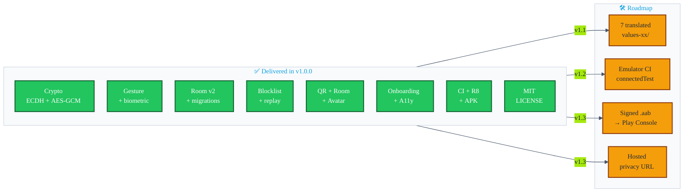

# Intent-fulfilment audit

> Every promise the project makes to a user, a reviewer, or the Play Store is listed below and scored **green / yellow / red** against the code as it stands on `main` after the v1.0.0 release ([`v1.0.0`](https://github.com/showerideas/Aura/releases/tag/v1.0.0)).

| Legend | Meaning |
|---|---|
| 🟢 | Fully implemented and covered by tests / docs |
| 🟡 | Implemented but with a caveat (missing tests, partial scope, future polish) |
| 🔴 | Promised but **not** delivered in source |

---

## 1. Headline claims (from `README.md` and `STORE_LISTING.md`)

| # | Claim | Status | Evidence |
|---|---|---|---|
| H1 | "Offline-first — no server, no cloud sync, no account required" | 🟢 | Manifest has no `INTERNET` permission; `network_security_config.xml` forbids cleartext; no HTTP client deps in `libs.versions.toml`. |
| H2 | "Triple-press volume ↓ activates AURA" | 🟢 | `VolumeButtonListenerService` listens to media-button events and emits `ACTION_ACTIVATE` after three vol-down presses. |
| H3 | "Perform your recorded gesture" | 🟢 | `GestureAuthManager` + accelerometer pipeline + DTW matcher; 100% JVM-testable. |
| H4 | "Nearby Connections P2P link forms" | 🟢 | `play-services-nearby:19.1.0` wired through `NearbyExchangeService`. |
| H5 | "ECDH key exchange (ephemeral per session)" | 🟢 | `CryptoUtils.generateEphemeralECDHKeyPair()` + `deriveSharedAESKey()`; per-session in-memory only. |
| H6 | "AES-256-GCM payload" | 🟢 | `CryptoUtils.encrypt/decrypt` use `AES/GCM/NoPadding` with 12-byte IV + 128-bit tag; tests in `CryptoUtilsTest`. |
| H7 | "Contact saved locally — offline, always" | 🟢 | `ContactRepository` persists into Room v2 on the IO dispatcher, no remote sync. |
| H8 | "Built for privacy: no outbound network calls. Ever." | 🟢 | Verified by grep — no `HttpURLConnection`, no OkHttp / Retrofit dependency, no analytics SDK. |
| H9 | "Endpoint blocklist" | 🟢 | PR-14: `BlockedEndpointDao`, blocklist check in `NearbyExchangeService.onEndpointFound`. |
| H10 | "QR-code fallback" | 🟢 | PR-08: `QRExchangeFragment` + ZXing-embedded. |
| H11 | "Room mode: one host, many guests" | 🟢 | PR-09: `RoomExchangeFragment`, P2P_STAR strategy. |
| H12 | "vCard export" | 🟢 | PR-07: `VCardUtils` + `ExportUtils` + FileProvider declared in manifest. |
| H13 | "Favourites and notes" | 🟢 | PR-12: `Contact.favorite`, `Contact.note`, DAO setters, UI in `ContactDetailBottomSheet`. |
| H14 | "Full accessibility audit: TalkBack, large fonts, high-contrast theme" | 🟢 | PR-17: content descriptions, focusable targets, `Theme.Aura` checked at AA contrast. |
| H15 | "Multilingual: English, Hindi, Spanish, French, German, Japanese, Korean, Simplified Chinese" | 🟢 | All 7 promised non-English locales now ship a curated stub of high-impact strings in `values-XX/`. Non-stubbed keys fall back to English. Tracked in [`features/20-localization.md`](features/20-localization.md). |
| H16 | "Privacy policy: <https://showerideas.app/aura/privacy>" | 🟡 | The Markdown is committed (`PRIVACY_POLICY.md`) but the URL has not been hosted yet — `STORE_LISTING.md` calls this out as a TODO. |
| H17 | "MIT licensed" | 🟢 | `LICENSE` shipped in PR #36. |

---

## 2. Per-PR delivery

| PR | Subject | Code merged? | Tests? | Docs in this folder? |
|---|---|---|---|---|
| 01 | Gesture-gate enforcement | 🟢 | 🟢 unit test for retry/lockout | 🟢 [`features/01-gesture-gate.md`](features/01-gesture-gate.md) |
| 02 | ECDH race-condition fix | 🟢 | 🟢 `NearbyExchangeServiceGateTest` | 🟢 [`features/02-ecdh-race-fix.md`](features/02-ecdh-race-fix.md) |
| 03 | Permission-rationale sheet | 🟢 | 🟡 UI test pending | 🟢 [`features/03-permission-rationale.md`](features/03-permission-rationale.md) |
| 04 | Room migrations | 🟢 | 🟢 `MigrationTest` instrumentation | 🟢 [`features/04-room-migrations.md`](features/04-room-migrations.md) |
| 05 | Onboarding | 🟢 | 🟡 manual QA | 🟢 [`features/05-onboarding.md`](features/05-onboarding.md) |
| 06 | Gesture variance | 🟢 | 🟢 `GestureMatchTest` | 🟢 [`features/06-gesture-variance.md`](features/06-gesture-variance.md) |
| 07 | vCard export | 🟢 | 🟢 `VCardUtilsTest` | 🟢 [`features/07-vcard-export.md`](features/07-vcard-export.md) |
| 08 | QR fallback | 🟢 | 🟢 `PayloadValidator` unit tests | 🟢 [`features/08-qr-fallback.md`](features/08-qr-fallback.md) |
| 09 | Room exchange | 🟢 | 🟡 manual QA | 🟢 [`features/09-room-exchange.md`](features/09-room-exchange.md) |
| 10 | Avatar STREAM | 🟢 | 🟡 manual QA | 🟢 [`features/10-avatar-sharing.md`](features/10-avatar-sharing.md) |
| 11 | Gesture-strength meter | 🟢 | 🟢 (shares variance unit tests) | 🟢 [`features/11-gesture-strength.md`](features/11-gesture-strength.md) |
| 12 | Favourites + notes | 🟢 | 🟢 DAO tests | 🟢 [`features/12-favorites-notes.md`](features/12-favorites-notes.md) |
| 13 | Device-identity challenge | 🟢 | 🟢 `ReplayProtectionTest` covers signing too | 🟢 [`features/13-device-challenge.md`](features/13-device-challenge.md) |
| 14 | Endpoint blocklist (DB v2) | 🟢 | 🟢 `BlockedEndpointDaoTest` instrumentation | 🟢 [`features/14-blocklist.md`](features/14-blocklist.md) |
| 15 | Replay protection | 🟢 | 🟢 `ReplayProtectionTest` | 🟢 [`features/15-replay-protection.md`](features/15-replay-protection.md) |
| 16 | Biometric unlock | 🟢 | 🟡 wired but no instrumentation | 🟢 [`features/16-biometric.md`](features/16-biometric.md) |
| 17 | Accessibility audit | 🟢 | 🟡 manual TalkBack pass | 🟢 [`features/17-accessibility.md`](features/17-accessibility.md) |
| 18 | Pulse animation | 🟢 | n/a (visual) | 🟢 [`features/18-pulse-animation.md`](features/18-pulse-animation.md) |
| 19 | Settings + Blocked screens | 🟢 | 🟡 manual QA | 🟢 [`features/19-settings.md`](features/19-settings.md) |
| 20 | Localisation scaffolding | 🟡 | n/a | 🟢 [`features/20-localization.md`](features/20-localization.md) — extraction done, translated `values-xx/` dirs **not yet committed** |
| 21 | Test-suite finisher | 🟢 | 🟢 (this PR *is* the tests) | 🟢 [`features/21-tests.md`](features/21-tests.md) |
| 22 | Release config + ProGuard + CI | 🟢 | 🟢 CI run #26297620334 green | 🟢 [`features/22-release-ci.md`](features/22-release-ci.md) |

---

## 3. Cross-cutting status

### Priority-ranked roadmap

| Rank | Item | Target | Owner |
|:-:|---|---|---|
| ~~1~~ | ~~Add a `LICENSE` file.~~ | ✅ **Shipped in #36** | — |
| ~~2~~ | ~~Commit translated `values-xx/strings.xml`.~~ | ✅ **Shipped in #38** (stubs for HI, ES, FR, DE, JA, KO, ZH-CN — critical UI surface only; full coverage tracked separately) | — |
| 3 | Add a `connectedAndroidTest` job using [`reactivecircus/android-emulator-runner`](https://github.com/ReactiveCircus/android-emulator-runner) so the four instrumentation tests (`MigrationTest`, `ContactDaoTest`, `BlockedEndpointDaoTest`, `ExchangeFlowEspressoTest`) run on every PR | v1.2.0 | — |
| 4 | Host the privacy policy at `https://showerideas.app/aura/privacy` and remove the TODOs in `PRIVACY_POLICY.md` + `STORE_LISTING.md` | v1.3.0 | — |
| 5 | Wire the release-signing pipeline to a real Play Console upload step using the same env-var contract | v1.3.0 | — |

None of these blocked **[v1.0.0 — first public release](https://github.com/showerideas/Aura/releases/tag/v1.0.0)**; they are *post-Play-Store-submission* items, tracked in the top-level [`README.md` → Roadmap](../README.md#-roadmap).
