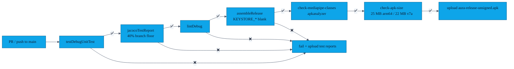

# Building AURA

> AURA is a standard Android-Gradle project. You can build it from the CLI on any machine that has a JDK and the Android SDK, or open it in Android Studio Ladybug (2024.2+).

---

## 1. Prerequisites

| Tool | Version | Why |
|---|---|---|
| JDK | **17** (Temurin recommended) | Matches CI; AGP 8.4 requires JDK 17. |
| Android SDK | platform-35, build-tools 35, platform-tools | `compileSdk = 35` |
| Android Studio | Ladybug 2024.2.1+ (optional) | For UI / Espresso work |
| A physical device | API 26+ with BLE | Emulators lack BLE radios; Nearby Connections needs a real radio. |

The Gradle wrapper (`./gradlew`) is committed, so you do not need a system-wide Gradle install.

---

## 2. Clone & first build

```bash
git clone https://github.com/showerideas/Aura.git
cd Aura
./gradlew assembleDebug
```

The debug APK lands at `app/build/outputs/apk/debug/app-debug.apk`. Side-load it onto your phone with:

```bash
adb install -r app/build/outputs/apk/debug/app-debug.apk
```

---

## 3. Useful Gradle tasks

| Task | What it does |
|---|---|
| `./gradlew assembleDebug` | Debug APK (`.debug` app-id suffix, `-debug` versionName suffix) |
| `./gradlew assembleRelease` | Release APK (R8 + resource shrinking). Unsigned unless `KEYSTORE_PATH` is set. |
| `./gradlew testDebugUnitTest` | JVM unit tests (gesture embedding, crypto, profile, payload validator, vCard, replay protection, SAS verifier) |
| `./gradlew lintDebug` | Android Lint against the existing baseline |
| `./gradlew connectedAndroidTest` | Espresso + Room migration + DAO tests on a connected device |
| `./gradlew :app:dependencies` | Resolve & print the dependency tree |

---

## 4. Release signing — locally

The release signing block in [`app/build.gradle.kts`](../app/build.gradle.kts) reads four env vars:

```bash
export KEYSTORE_PATH=/abs/path/to/aura-release.keystore
export KEYSTORE_STORE_PASSWORD=...
export KEYSTORE_KEY_ALIAS=aura
export KEYSTORE_KEY_PASSWORD=...

./gradlew assembleRelease
```

If `KEYSTORE_PATH` is unset **or** the empty string, Gradle skips the signing config entirely and produces an unsigned APK — that's what CI does (see [`features/22-release-ci.md`](features/22-release-ci.md)).

> The signed APK lands at `app/build/outputs/apk/release/app-release.apk`. Verify with `apksigner verify --verbose app-release.apk`.

---

## 5. CI parity

GitHub Actions (`.github/workflows/ci.yml`) runs the following steps against every PR and every push to `main`:



The CI APK artifact has a 14-day retention. The artifact from the most recent green run is what gets attached to a tagged GitHub Release (see [`features/22-release-ci.md`](features/22-release-ci.md)).

---

## 6. Build flavours / variants

There are intentionally only two: `debug` and `release`. We have not added staging / flavour dimensions because there is **no backend** — there is nothing to point at a "staging environment".

| Variant | App-id | versionName | Logging | Minify | Signing |
|---|---|---|---|---|---|
| debug | `com.showerideas.aura.debug` | `1.1.0-debug` | `BuildConfig.ENABLE_LOGGING=true` | off | debug keystore |
| release | `com.showerideas.aura` | `1.1.0` | `BuildConfig.ENABLE_LOGGING=false` | R8 + resource shrink | env-var driven |

`Timber.plant(DebugTree())` is gated on `ENABLE_LOGGING`, so the release APK does not emit logs.

---

## 7. Troubleshooting

| Symptom | Fix |
|---|---|
| `Could not find tools.jar` | You're on JDK 8/11 — switch to **17** (`JAVA_HOME=$(/usr/libexec/java_home -v 17)` on macOS). |
| `BLUETOOTH_SCAN permission` denied in logs | The user denied it; AURA shows the permission rationale sheet on the next attempt. See [`features/03-permission-rationale.md`](features/03-permission-rationale.md). |
| Nearby Connections says `STATUS_OUT_OF_RESOURCES` | The other device is already in an exchange; restart Bluetooth on both, then retry. |
| `assembleRelease` fails with `path may not be null or empty string` | You set `KEYSTORE_PATH` to a non-existent file. Either point it at a real keystore or **unset** it; the build script treats blank/empty as "no signing". |

For anything else, open an issue with the **debug** build's logcat (`adb logcat | grep -i aura`).
