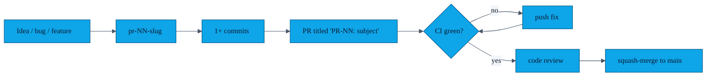

# Contributing to AURA

> Thanks for considering a contribution. This file describes the conventions the repo already follows; please match them so reviews stay short.

---

## 1. Branch & PR conventions

Every change ships as one PR, named `PR-NN<letter>: <subject>`. The number is the next free integer (look at `git log --oneline`). The optional letter is for follow-ups that fix a previously merged PR — e.g. `PR-22h` was a lint hot-fix for `PR-22`.

Branch names follow `pr-NN-short-slug` (lowercase, hyphens).



---

## 2. Commit message style

Each commit starts with the PR tag, e.g.

```
PR-23: avatar caching for ContactsAdapter
```

If you push multiple commits to the same PR, keep the same tag so a `git log --grep="PR-23"` finds them all. Squash-merge collapses them into one commit on `main`.

---

## 3. Required CI checks

A PR cannot be merged until **all three** Gradle gates pass on GitHub Actions:

| Gate | Command | Why |
|---|---|---|
| Unit tests | `./gradlew testDebugUnitTest` | Catches DTW / crypto / payload regressions cheaply. |
| Lint | `./gradlew lintDebug` | Stops new warnings; pre-existing ones are silenced by the baseline. |
| Release assembly | `./gradlew assembleRelease` | Validates ProGuard rules and R8 against every transitive dep. CI leaves the signing env vars blank → unsigned APK. |

Instrumentation tests (`connectedAndroidTest`) are **not** in CI yet (tracked as a follow-up in [`AUDIT.md`](AUDIT.md)). If your PR changes Room or anything sensor-bound, please run them locally and paste a screenshot of the result in the PR body.

---

## 4. Style

- **Kotlin first.** No Java unless you have a *very* good reason.
- **Two-space indentation** in XML, four-space in Kotlin (matches the existing files; IDE rule-set commits are welcome).
- **No top-level `var`** — use `val` and immutable data classes.
- **`Timber` for logs**, gated on `BuildConfig.ENABLE_LOGGING`.
- **No new dependencies without a one-line justification in the PR description.** Each transitive blob hurts R8 and increases supply-chain risk.
- **No reflection on user data.** Gson is fine; arbitrary Java reflection on `Profile` / `Contact` is not.

---

## 5. Where new code goes

| You are adding… | Put it in… |
|---|---|
| A new screen | `ui/<feature>/` — Fragment + ViewModel + a `nav_graph.xml` destination |
| A new entity | `model/` + DAO in `data/local/` + repository in `data/` + a `MigrationTest` row |
| A new crypto primitive | `utils/CryptoUtils.kt` — add a JVM unit test in `app/src/test/` |
| A new permission | `AndroidManifest.xml` + a bottom-sheet rationale in `PermissionRationaleBottomSheet` + an entry in [`docs/features/03-permission-rationale.md`](features/03-permission-rationale.md) |
| A new string | `app/src/main/res/values/strings.xml` (English source of truth) + a TODO for translators |

---

## 6. Security-sensitive changes

If your PR touches:

- `CryptoUtils.kt`
- `NearbyExchangeService.kt`
- `AndroidManifest.xml` permissions block
- anything in `app/src/main/res/xml/` (network / backup / data-extraction rules)

… please flag the PR with the `security` label and request review from at least two maintainers. We hold these to a higher bar — see [`SECURITY.md`](SECURITY.md).

---

## 7. Reporting bugs / vulnerabilities

- **Functional bug** → open an issue, include device model + Android version + redacted logcat.
- **Security issue** → **do not** open a public issue. Email `security@showerideas.app` or open a private GitHub Security Advisory.

---

## 8. Code of conduct

Be kind. Assume good faith. AURA is built by humans for face-to-face interactions; let's keep the repo the same.
