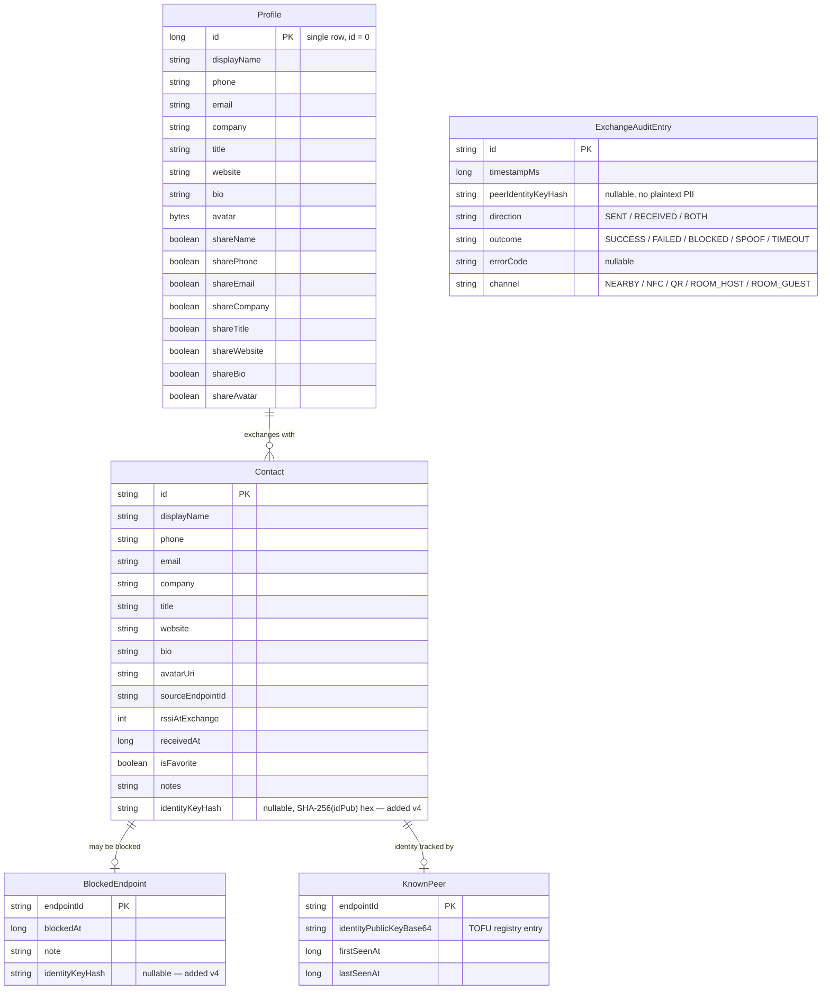
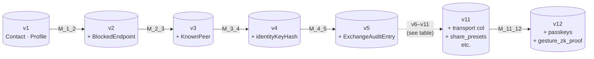

# Data model

> Everything that survives a process restart lives in **one Room database** (`AppDatabase`, currently at schema version `12`), plus a small amount of preference data in `DataStore` and `EncryptedSharedPreferences`.

---

## 1. Entity-relationship diagram

> The `Profile` table is intentionally a singleton — there is exactly one *me* per install. The DAO upserts on `id = 0`.

---

## 2. Schema versions

| Version | Change | Migration |
|---|---|---|
| `1` | Initial scaffold — `contacts`, `profiles` | (fresh install baseline) |
| `2` | Add `blocked_endpoints` table | `MIGRATION_1_2` |
| `3` | Add `known_peers` table (TOFU endpoint-identity registry) | `MIGRATION_2_3` |
| `4` | Add `identityKeyHash TEXT` column to `blocked_endpoints` and `contacts` | `MIGRATION_3_4` |
| `5` | Add `exchange_audit_log` table (privacy-preserving exchange history, no PII) | `MIGRATION_4_5` |

Schema JSON exports live under `app/schemas/com.showerideas.aura.data.local.AppDatabase/<version>.json` and are verified by `MigrationTest.kt` at instrumentation-test time.

---

## 3. DAO surface

| DAO | Public methods | Returns |
|---|---|---|
| `ContactDao` | `insertContact`, `updateContact`, `deleteContact`, `getAll`, `search(query)`, `getById`, `setFavorite`, `setNote` | `Flow<List<Contact>>` for streaming reads, suspending functions for writes |
| `ProfileDao` | `getProfile`, `upsertProfile` | `Flow<Profile?>` / suspend |
| `BlockedEndpointDao` | `insert`, `delete`, `isBlocked`, `getAll` | `Flow<List<BlockedEndpoint>>` / suspend / `Boolean` |
| `KnownPeerDao` | `upsert`, `findByEndpointId`, `deleteByEndpointId` | suspend / nullable entity |
| `ExchangeAuditDao` | `insert`, `getAll`, `getRecent(limit)` | `Flow<List<ExchangeAuditEntry>>` / suspend |

The repositories (`ContactRepository`, `ProfileRepository`, `BlocklistRepository`, `KnownPeerRepository`, `ExchangeAuditRepository`) own the suspending I/O dispatcher (`Dispatchers.IO`) and expose `Flow`s to ViewModels.

---

## 4. What deliberately does **not** live in Room

| Datum | Where | Why |
|---|---|---|
| Gesture feature vector | `EncryptedSharedPreferences` | Sensitive, never queried in lists; encryption-at-rest is more important than relational access. |
| Identity key | Android Keystore | Non-extractable hardware-backed material — Room would force us to load it into memory. |
| Auth-method preference (gesture vs biometric) | DataStore (`AuthPreferences`) | Reactive `Flow<>` updates without a full Room dependency. |
| Onboarding-completed flag | DataStore (`OnboardingPreferences`) | Single boolean, doesn't earn its own table. |
| Replay nonce cache | In-memory `ConcurrentHashSet` in `PayloadValidator` | Ephemeral per-process; purged every 5 min. Not persisted — replays across restarts are caught by the `_ts` recency window. |

---

## 5. Backup exclusion

`AndroidManifest.xml` sets `allowBackup="false"` and references `xml/backup_rules.xml` + `xml/data_extraction_rules.xml`. Together they exclude:

- the Room database file (`databases/aura.db*`),
- `EncryptedSharedPreferences` files,
- DataStore `.preferences_pb` files.

In practical terms: **nothing AURA stores is uploaded to Google's Auto-Backup or transferred during Device-to-Device migration.** A new install on a new phone starts empty by design — the entire trust model rests on the keystore-bound identity that *cannot* be migrated.
