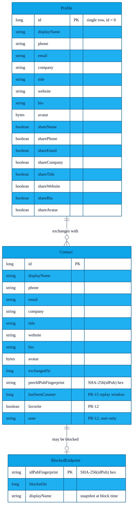
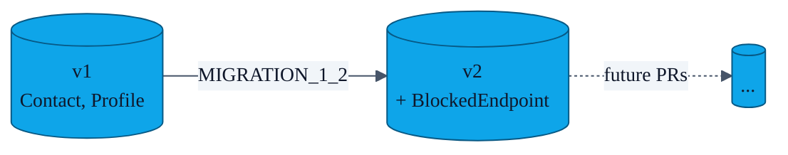

# Data model

> Everything that survives a process restart lives in **one Room database** (`AppDatabase`, currently at schema version `2`), plus a small amount of preference data in `DataStore` and `EncryptedSharedPreferences`.

---

## 1. Entity-relationship diagram

> The `Profile` table is intentionally a singleton — there is exactly one *me* per install. The DAO upserts on `id = 0`.

---

## 2. Schema versions

| Version | Introduced in | Tables | Notes |
|---|---|---|---|
| `1` | initial scaffold | `Contact`, `Profile` | Schema file: `app/schemas/com.showerideas.aura.data.local.AppDatabase/1.json` |
| `2` | PR-14 endpoint blocklist | `Contact`, `Profile`, `BlockedEndpoint` | Migration `MIGRATION_1_2` adds the new table without touching existing rows. Schema file: `app/schemas/com.showerideas.aura.data.local.AppDatabase/2.json` |

The migration is exercised at instrumentation-test time in `MigrationTest.kt` against the on-disk schema JSON; see [`features/04-room-migrations.md`](features/04-room-migrations.md).

---

## 3. DAO surface

| DAO | Public methods | Returns |
|---|---|---|
| `ContactDao` | `insertContact`, `updateContact`, `deleteContact`, `getAll`, `search(query)`, `getById`, `setFavorite`, `setNote`, `updateLastSeenCounter` | `Flow<List<Contact>>` for streaming reads, suspending functions for writes |
| `ProfileDao` | `getProfile`, `upsertProfile` | `Flow<Profile?>` / suspend |
| `BlockedEndpointDao` | `insert`, `delete`, `isBlocked`, `getAll` | `Flow<List<BlockedEndpoint>>` / suspend / `Boolean` |

The repositories (`ContactRepository`, `ProfileRepository`, `BlocklistRepository`) own the suspending I/O dispatcher (`Dispatchers.IO`) and expose the `Flow`s to ViewModels.

---

## 4. What deliberately does **not** live in Room

| Datum | Where | Why |
|---|---|---|
| Gesture feature vector | `EncryptedSharedPreferences` | Sensitive, never queried in lists; encryption-at-rest is more important than relational access. |
| Identity key | Android Keystore | Non-extractable hardware-backed material — Room would force us to load it into memory. |
| Auth-method preference (gesture vs biometric) | DataStore (`AuthPreferences`) | Reactive `Flow<>` updates without a full Room dependency. |
| Onboarding-completed flag | DataStore (`OnboardingPreferences`) | Single boolean, doesn't earn its own table. |

---

## 5. Backup exclusion

`AndroidManifest.xml` sets `allowBackup="false"` and references `xml/backup_rules.xml` + `xml/data_extraction_rules.xml`. Together they exclude:

- the Room database file (`databases/aura.db*`),
- `EncryptedSharedPreferences` files,
- DataStore `.preferences_pb` files.

In practical terms: **nothing AURA stores is uploaded to Google's Auto-Backup or transferred during Device-to-Device migration.** A new install on a new phone starts empty by design — the entire trust model rests on the keystore-bound identity that *cannot* be migrated.
