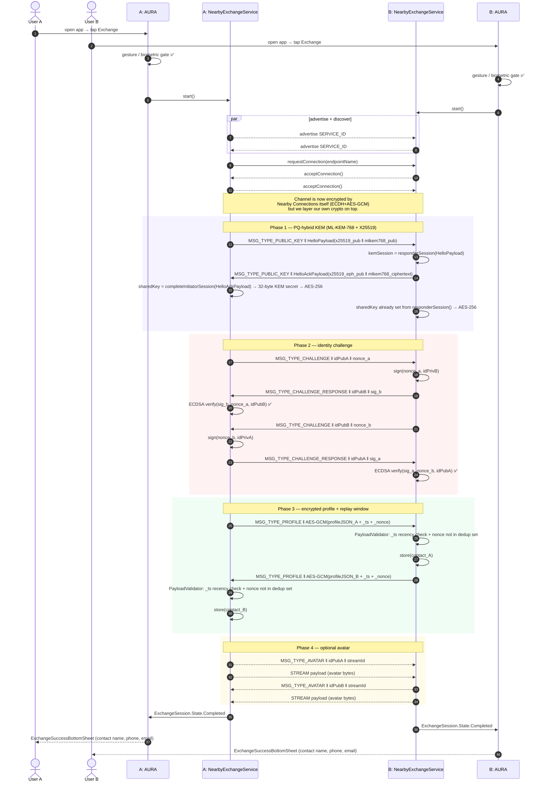
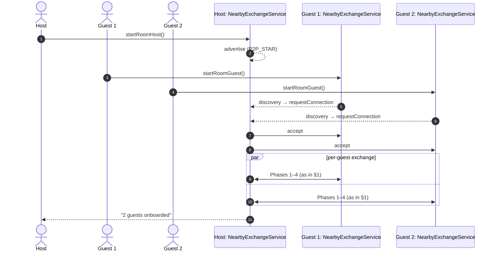
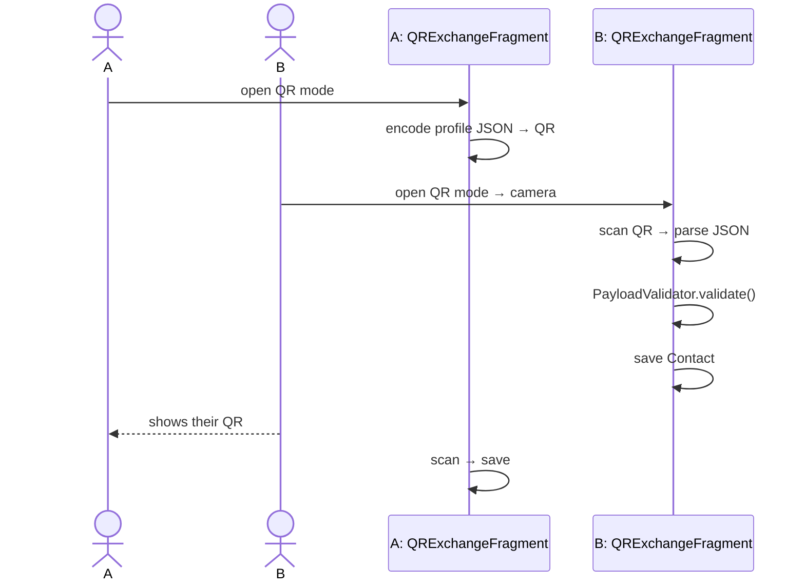
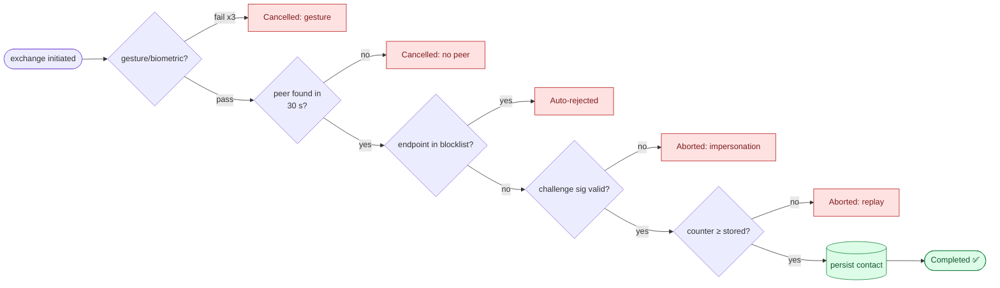
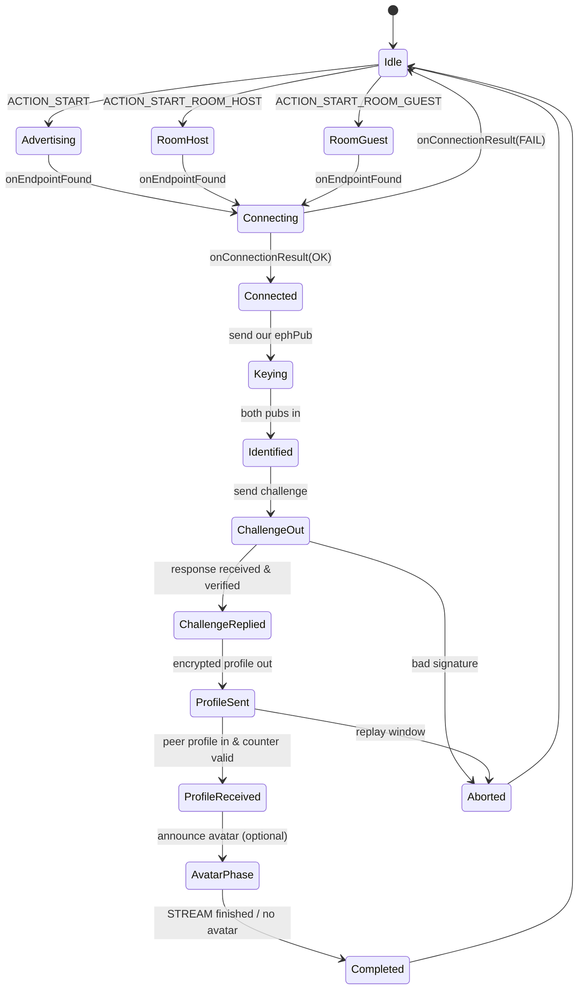

# Exchange flow

> An exchange begins when both users open AURA and tap Exchange, the gesture/biometric gate has cleared on each side, and the two phones are within Nearby Connections range. The sequence below walks every byte sent in a successful direct exchange.
>
> AURA supports three exchange paths: Nearby Connections (primary), QR relay (fallback), and DIDComm v2 (identity-layer).
> See §4 below for the DIDComm exchange flow and ISO 18013-7 async mDL presentation path.

---

## 1. The happy path — direct (1-to-1) exchange



### Notes on the phases

- **Phase 1** runs a **post-quantum hybrid KEM** (ML-KEM-768 + X25519) *on top of* the encryption Nearby Connections already provides. The initiator sends a `HelloPayload` (X25519 pub + ML-KEM-768 pub); the responder encapsulates against both, sends back a `HelloAckPayload` (X25519 ephemeral pub + ML-KEM-768 ciphertext). Both derive a 32-byte shared secret via `HKDF-SHA256(mlkem_ss ‖ x25519_ss)`. The session key breaks only if *both* algorithms are broken simultaneously. NFC-bootstrapped sessions fall back to classical ECDH for the bootstrap step only.
- **Phase 2** binds the session to each side's Android-Keystore **ML-DSA-65 + ECDSA P-256 hybrid** identity key. The nonce is 32 cryptographically random bytes; the signature is over `nonce ‖ idPub` to prevent cross-protocol misuse.
- **Phase 3** wraps the JSON profile in AES-GCM using the Phase-1 derived key. Two replay-protection fields are stamped into the plaintext envelope by `PayloadValidator.stamp()`: `_ts` (current epoch ms) and `_nonce` (random UUID). On receipt, `PayloadValidator.validate()` checks `_ts` is within the allowed recency window and that `_nonce` has not been seen before — a bounded `ConcurrentHashSet` (max 1,000 entries, purged every 5 min) acts as the dedup store.
- **Phase 4** is optional. The avatar travels as a Nearby Connections `STREAM` payload (not `BYTES`), so multi-megabyte images don't block the small text messages.

---

## 2. Room mode (1 host : N guests, )



In room mode the host runs `P2P_STAR` so multiple guests can connect simultaneously; each guest still does its own ECDH and challenge so the host receives **N** independent secure sessions, not a broadcast.

---

## 3. QR fallback

When BLE / Wi-Fi P2P is blocked (some corporate venues, locker-room metal cages), the user can switch to QR mode:



The QR payload is **not** encrypted on the wire (a camera in line of sight is the channel), but it still passes through `PayloadValidator` to reject oversized fields, foreign keys, and embedded HTML.

---

## 4. Failure / abort paths



Each `Aborted` branch surfaces in the UI as a localized message (see [`features/01-gesture-gate.md`](features/01-gesture-gate.md), [`features/13-device-challenge.md`](features/13-device-challenge.md), [`features/14-blocklist.md`](features/14-blocklist.md), [`features/15-replay-protection.md`](features/15-replay-protection.md)) and is logged via Timber on debug builds only.

---

## 5. State machine inside `NearbyExchangeService`



This is the same finite-state machine drawn at a coarser level in [`ARCHITECTURE.md`](ARCHITECTURE.md#3-class-level-overview-of-the-exchange-service); the version above includes the explicit abort transitions.

---

## 4. DIDComm v2 exchange path

The DIDComm exchange path enables asynchronous, store-and-forward contact exchange
with any DIDComm v2-compatible wallet (including enterprise identity wallets).

```
Enterprise Wallet                    AURA (recipient)
     │                                      │
     │── DIDComm authcrypt envelope ─────→  │  DIDCommTransport.receive()
     │   type: aura.exchange.v1/request     │
     │   body: { vc, nonce, requesterDid }  │  → DIDCommInboxFragment shows consent dialog
     │                                      │
     │                                      │  User performs enrolled gesture
     │                                      │  GestureVerificationEngine.verify()
     │                                      │
     │  ←─── DIDComm authcrypt envelope ──  │  DIDCommTransport.send()
     │   type: aura.exchange.v1/response    │
     │   body: { vc, nonce_ack }            │
     │                                      │
     │  OR if declined:                     │
     │  ←─── type: report-problem ────────  │
     │        code: e.p.req.declined        │
```

Messages are routed via the AURA relay (`RelayClient`) using the `did:peer:2`
pairwise DID as the inbox slot identifier.

### ISO 18013-7 async mDL presentation

ISO 18013-7 extends ISO 18013-5 proximity presentation to an online (async) path
using OpenID4VP as the transport. The AURA verifier accepts `vp_token` responses
from any mDL wallet via `MdocDocument.fromOid4vpResponse()`.

```
Verifier (AURA)            mDL Wallet (remote)
     │                            │
     │── OpenID4VP AuthRequest ─→ │  response_type=vp_token
     │   nonce, presentation_def  │  presentation_definition: id.aura.contact.1
     │                            │
     │ ←─── vp_token (Base64url ─ │  DeviceResponse CBOR
     │        DeviceResponse)     │
     │                            │
     │  MdocDocument.fromOid4vpResponse(vpTokenJson, nonce)
     │  → MdocDocument with verified elements
```
