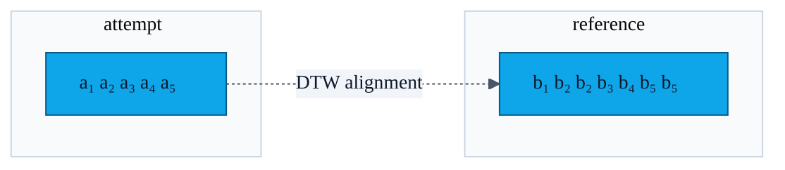
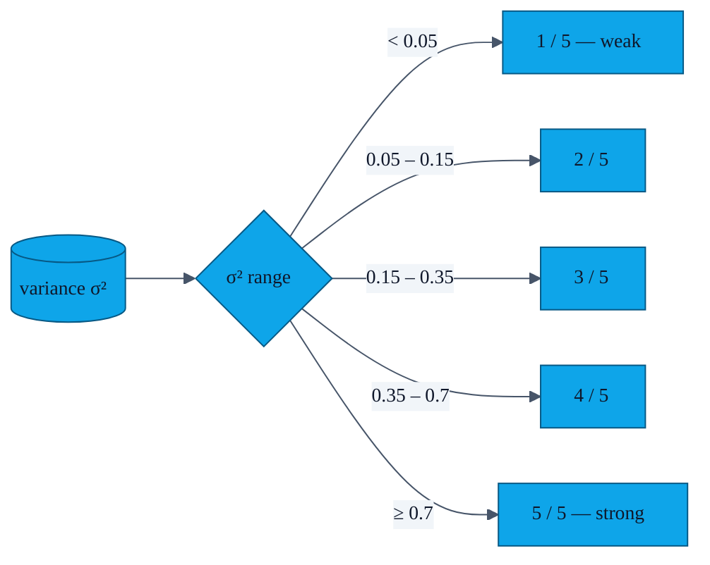

# Gesture authentication

> AURA's signature interaction is a **personal motion** that gates every exchange. This page explains how that motion travels from the accelerometer into a stored feature vector, how the matcher decides whether a fresh attempt is "you", and how the strength meter is computed.

The implementation lives in [`GestureAuthManager.kt`](../app/src/main/java/com/showerideas/aura/auth/GestureAuthManager.kt) (~317 lines).

---

## 1. Pipeline overview

```mermaid
%%{init: {'theme':'base','themeVariables':{
  'fontFamily':'ui-monospace, SFMono-Regular, Menlo, Monaco, monospace',
  'fontSize':'14px',
  'primaryColor':'#0EA5E9',
  'primaryTextColor':'#0F172A',
  'primaryBorderColor':'#075985',
  'lineColor':'#475569',
  'secondaryColor':'#F1F5F9',
  'tertiaryColor':'#FAFAF9',
  'clusterBkg':'#F8FAFC',
  'clusterBorder':'#CBD5E1'
},'flowchart':{'curve':'basis','nodeSpacing':40,'rankSpacing':50,'padding':12},'sequence':{'actorMargin':50,'boxMargin':10,'noteMargin':10,'messageMargin':35}}}%%
flowchart LR
    A[Accelerometer<br/>SensorManager<br/>SENSOR_DELAY_GAME] --> B[Ring buffer of<br/>GestureEvent(x,y,z,t)]
    B --> C{Recording<br/>finished?}
    C -- no --> A
    C -- yes --> D[Magnitude per sample<br/>√(x²+y²+z²)]
    D --> E[Resample to 50 points<br/>linear interpolation]
    E --> F[Z-normalise<br/>(mean=0, sd=1)]
    F --> G[Feature vector<br/>FloatArray(50)]
    G --> H{Variance<br/>≥ threshold? PR-06}
    H -- no --> X1[Reject:<br/>"motion too flat"]
    H -- yes --> I{Mode}
    I -- record --> J[EncryptedSharedPreferences<br/>aura_gesture_pattern_v1]
    I -- match --> K[DTW vs stored<br/>distance ≤ τ ?]
    K -- yes --> L[✅ unlock]
    K -- no --> M[❌ retry / lockout]
```

The whole pipeline is JVM-pure once the samples are captured — `computeVariance` and `dtw` are covered by `app/src/test/java/com/showerideas/aura/GestureMatchTest.kt`.

---

## 2. Why DTW and not a hash?

A user's motion will *never* be repeated exactly: the speed, amplitude, and orientation drift between attempts. **Dynamic Time Warping** measures how well two sequences align under non-linear time stretching, so a slightly faster repetition of the same shape still matches. A cryptographic hash would force the user to be a robot.



The DTW cost matrix is `O(n·m)`, which at `n=m=50` is negligible (2 500 cells).

---

## 3. Variance gate (PR-06)

A flat or near-constant feature vector — for example, the phone sitting on a table — would happen to "match" almost anything because z-normalisation collapses it. We therefore compute the population variance of the *raw* magnitude series before normalising, and refuse to register or match if it is below a configurable threshold. The threshold and exact formula live in `GestureAuthManager.computeVariance` (`internal` for unit-testability).

---

## 4. Strength meter (PR-11)

The strength meter on the Profile screen turns the same variance value into a 1-of-5 bar visualisation:



UI-side details (drawable, layout, label) are in [`features/11-gesture-strength.md`](features/11-gesture-strength.md).

---

## 5. Storage

| What | Where |
|---|---|
| The raw `GestureEvent` list during recording | RAM only — discarded when recording stops |
| The 50-float feature vector + variance | `EncryptedSharedPreferences` (`aura_gesture_prefs_v1`) under key `pattern_v1` |
| The EncryptedSharedPreferences master key | Android Keystore alias `aura_esp_master` (built via `MasterKey.Builder`) |
| The Room DB | App-private storage; **does not** contain the gesture |
| Auto-Backup / Device-to-Device | Excluded — see `app/src/main/res/xml/backup_rules.xml` and `data_extraction_rules.xml` |

The raw recording is never persisted, so even an attacker with physical access plus knowledge of the master key sees only an abstract numeric fingerprint, not a replayable motion trace.

---

## 6. Match-failure UX

Per [`features/01-gesture-gate.md`](features/01-gesture-gate.md):

- **Attempt 1 fails** → "Gesture didn't match. 2 attempt(s) left."
- **Attempt 2 fails** → "Gesture didn't match. 1 attempt(s) left."
- **Attempt 3 fails** → "Too many failed gesture attempts. Exchange cancelled."
- **No gesture set at all** → modal "No gesture set — exchange is unprotected. Continue?" so the user must consciously accept the lower bar.

Biometric is offered as an alternative on devices that have it enrolled — see [`features/16-biometric.md`](features/16-biometric.md).
