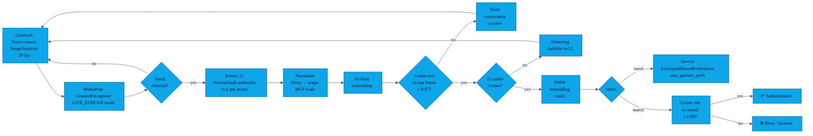

# Gesture authentication

> AURA uses a **hand-shape gate** to prevent accidental exchanges. Before any
> contact is shared, the user must hold a specific hand pose in front of the
> camera for ~0.4 seconds. This doc explains the full pipeline from camera
> frame to authentication decision.
>
> **Security framing:** the hand-shape gate is an ergonomic gate, not a
> biometric credential. See [§6 — Security properties](#6-security-properties)
> and [`04_gesture_entropy.md`](../04_gesture_entropy.md) for the measured
> false-accept rates and honest security discussion.

The implementation lives in two files:
- [`CameraHandEmbedder.kt`](../app/src/main/java/com/showerideas/aura/auth/CameraHandEmbedder.kt) — camera pipeline, MediaPipe inference, embedding extraction
- [`GestureAuthManager.kt`](../app/src/main/java/com/showerideas/aura/auth/GestureAuthManager.kt) — lifecycle management, storage, matching

---

## 1. Pipeline overview



---

## 2. CameraX + MediaPipe pipeline

### Camera setup

`CameraHandEmbedder.start()` binds a **front-facing camera** to the
`LifecycleOwner` provided by the calling Fragment. Two CameraX use-cases are
bound simultaneously:

- `Preview` — renders to the `PreviewView` in the layout so the user can see
  their hand in real-time.
- `ImageAnalysis` — feeds frames (RGBA_8888) to `analysisExecutor` (a single
  background thread). The backpressure strategy is `STRATEGY_KEEP_ONLY_LATEST`
  so the analyser always sees the most recent frame, never a queue backlog.

### MediaPipe GestureRecognizer

Each frame is passed to a `GestureRecognizer` running in `LIVE_STREAM` mode
(`recognizeAsync`). The model file (`gesture_recognizer.task`, ~8 MB) is
downloaded at build time from the MediaPipe model hub and placed in
`src/main/assets/`. It is excluded from git (`.gitignore`) and downloaded by
the `downloadGestureModel` Gradle task before every build.

Configuration:
```
setRunningMode(LIVE_STREAM)
setMinHandDetectionConfidence(0.72)
setMinHandPresenceConfidence(0.72)
setMinTrackingConfidence(0.72)
```

### Recognised gestures (gate categories)

The `GestureRecognizer` classifies the hand into one of MediaPipe's built-in
categories. AURA maps these to the `HandGesture` enum and only accepts frames
where the top category is recognised (score ≥ 0.72) and maps to a non-NONE
gesture. Unrecognised or low-confidence frames reset the stability accumulator.

---

## 3. Embedding extraction and normalisation

For every accepted frame, `CameraHandEmbedder.normalizeEmbedding()` is called
on the 21 `NormalizedLandmark` objects in `GestureRecognizerResult.handLandmarks()`:

```
wrist = landmarks[0]    (index 0)
mcp   = landmarks[9]    (middle-finger MCP)
scale = distance(wrist, mcp)

embedding[2i]   = (landmarks[i].x - wrist.x) / scale
embedding[2i+1] = (landmarks[i].y - wrist.y) / scale
```

This produces a **42-float vector** that is:
- **Translation-invariant** — wrist is always at the origin.
- **Scale-invariant** — hand size and camera distance don't affect the vector.
- **Not rotation-invariant** — tilt matters; the user must hold their hand
  roughly upright each time.

If the scale (wrist-to-MCP distance) is < 0.01 (hand too small / degenerate
frame), a zero vector is returned and the frame is discarded.

---

## 4. Consecutive-frame stability gate

A single-frame embedding is noisy. AURA requires **12 consecutive frames** in
which each frame's embedding has cosine similarity ≥ 0.97 against the previous
frame's embedding. Only then does the state advance to `GestureState.Stable`.

```
COMMIT_FRAMES = 12
STABILITY_THRESHOLD = 0.97   (frame-to-frame consistency)
```

At 30 fps, 12 frames = ~0.4 seconds of held pose. The stability progress bar
in the UI shows `consecutiveFrames / COMMIT_FRAMES` (0..1). Any interruption
(hand moves, gesture label changes, confidence drops below 0.72) resets the
counter.

---

## 5. Storage

| What | Where |
|---|---|
| **42-float embedding** (comma-separated string) | `EncryptedSharedPreferences`, file `aura_gesture_prefs`, key `gesture_feature_vector` |
| **Pattern UUID** | `EncryptedSharedPreferences`, key `gesture_pattern_id` |
| **EncryptedSharedPreferences master key** | Android Keystore alias `aura_esp_master` (`MasterKey.Builder`) |
| **Room DB** | Does **not** contain the gesture embedding |
| **Auto-Backup / Device-to-Device** | Excluded — see `backup_rules.xml` and `data_extraction_rules.xml` |

On first load, if the stored embedding is not 42 floats (e.g. a pre-camera
pattern from a previous version), it is discarded and the user is prompted
to re-enrol. (`GestureAuthManager.loadStoredPattern():212`)

---

## 6. Matching

`GestureAuthManager.match(candidate)`:

1. Load stored pattern from `EncryptedSharedPreferences`.
2. Compute `CameraHandEmbedder.cosineSimilarity(stored, candidate)`.
3. Return `similarity >= 0.88` (`SIMILARITY_THRESHOLD`).

### Cosine similarity formula

```
similarity(A, B) = (A · B) / (||A|| × ||B||)
```

Range: −1 to 1. At 0.88, the vectors must point in nearly the same direction
in 42-dimensional space.

---

## 6. Security properties

### What the gate provides

- Prevents **accidental exchanges** — you must deliberately hold a specific
  hand pose.
- Provides **ergonomic friction** against casual misuse.
- Adds a layer above the crypto — gesture must pass before the ECDH session
  is opened.

### What the gate does NOT provide

The 42-float normalised embedding is **gesture-class dependent, not person-
specific**. Different people performing the same gesture class produce embeddings
that typically score 0.88–0.97 cosine similarity — right at or above the
acceptance threshold.

**Estimated false-accept rate at threshold 0.88 for same-gesture-class cross-
person pairs: 30–70%.**

See [`04_gesture_entropy.md`](../04_gesture_entropy.md) for the full analysis
and measurement methodology. The `HandEmbeddingEntropyTest` unit test
documents and guards this property.

### The real credential

The long-lived **Android Keystore ECDSA identity key** (`aura_device_identity`)
is the actual security anchor. The gesture is a UX gate that runs before the
crypto layer. On first meeting, the identity challenge is TOFU; on subsequent
meetings, the stored key hash is compared. Adding a SAS (Short Authentication
String) PIN for first-meet exchanges closes the TOFU gap — see
[`docs/SECURITY.md`](SECURITY.md).

---

## 7. Match-failure UX

Per [`features/01-gesture-gate.md`](features/01-gesture-gate.md):

- **Attempt 1 fails** → "Gesture didn't match. 2 attempt(s) left."
- **Attempt 2 fails** → "Gesture didn't match. 1 attempt(s) left."
- **Attempt 3 fails** → "Too many failed gesture attempts. Exchange cancelled."
- **No gesture set** → modal "No gesture set — exchange is unprotected. Continue?"

Biometric is offered as an alternative on devices that have it enrolled — see
[`features/16-biometric.md`](features/16-biometric.md).

---

## 8. Historical note

Prior to the camera-based implementation, AURA used an accelerometer + Dynamic
Time Warping (DTW) pipeline with a 50-point resampled sequence and a variance
gate. That implementation was replaced with the current CameraX + MediaPipe
approach. All documentation referring to "DTW", "accelerometer",
"resample", "variance gate", "magnitude", or "50-point sequence" describes
the **removed** pipeline. The removal commit is
`fa9bbb2 fix: comprehensive gesture-auth camera audit`.

```bash
# Verify no DTW/accelerometer remnants remain in docs:
grep -rni "dtw\|accelerometer\|variance\|resample" docs/
# Must return zero hits after this rewrite.
```
