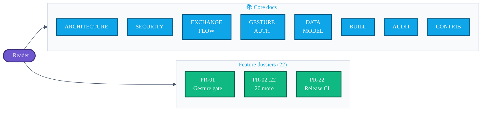

# AURA — Documentation hub

> The top-level [`README.md`](../README.md) is the front-face. **This folder is the engineering record** — what every layer does, why, and which PR shipped it.



---

## 📚 Core docs

| Doc | What's inside |
|---|---|
| [`ARCHITECTURE.md`](ARCHITECTURE.md) | Module map, package graph, dependency-direction rules, top-level diagrams |
| [`EXCHANGE_FLOW.md`](EXCHANGE_FLOW.md) | End-to-end sequence: gesture → ECDH → challenge → AES-GCM → avatar → replay window |
| [`SECURITY.md`](SECURITY.md) | Threat model, crypto primitives, key lifecycle, what AURA does **not** defend against |
| [`GESTURE_AUTH.md`](GESTURE_AUTH.md) | Accelerometer pipeline, DTW matcher, variance gate, strength meter, storage |
| [`DATA_MODEL.md`](DATA_MODEL.md) | Room v1 → v2 schema, entity diagram, DAO surface, migration tests |
| [`BUILD.md`](BUILD.md) | Toolchain, env vars, Gradle targets, CI parity, release signing |
| [`AUDIT.md`](AUDIT.md) | **Intent fulfilment audit** — every promise scored 🟢 / 🟡 / 🔴 |
| [`CONTRIBUTING.md`](CONTRIBUTING.md) | Branch / PR conventions, commit style, required checks |

---

## 🧩 Feature dossiers (one per PR)

Each dossier explains *what the user sees*, *what the code does*, and *what tests cover it*.

| # | Feature | Doc |
|:-:|---|---|
| 01 | Gesture-gate enforcement before exchange | [`features/01-gesture-gate.md`](features/01-gesture-gate.md) |
| 02 | ECDH race-condition fix | [`features/02-ecdh-race-fix.md`](features/02-ecdh-race-fix.md) |
| 03 | Permission-rationale bottom sheet | [`features/03-permission-rationale.md`](features/03-permission-rationale.md) |
| 04 | Room schema migrations | [`features/04-room-migrations.md`](features/04-room-migrations.md) |
| 05 | First-launch onboarding | [`features/05-onboarding.md`](features/05-onboarding.md) |
| 06 | Gesture-variance gate | [`features/06-gesture-variance.md`](features/06-gesture-variance.md) |
| 07 | vCard export | [`features/07-vcard-export.md`](features/07-vcard-export.md) |
| 08 | QR-code fallback exchange | [`features/08-qr-fallback.md`](features/08-qr-fallback.md) |
| 09 | Room mode (1 host : N guests) | [`features/09-room-exchange.md`](features/09-room-exchange.md) |
| 10 | Avatar STREAM sharing | [`features/10-avatar-sharing.md`](features/10-avatar-sharing.md) |
| 11 | Gesture-strength indicator | [`features/11-gesture-strength.md`](features/11-gesture-strength.md) |
| 12 | Favourites + notes | [`features/12-favorites-notes.md`](features/12-favorites-notes.md) |
| 13 | Device-identity challenge | [`features/13-device-challenge.md`](features/13-device-challenge.md) |
| 14 | Endpoint blocklist (DB v2) | [`features/14-blocklist.md`](features/14-blocklist.md) |
| 15 | Replay-attack protection | [`features/15-replay-protection.md`](features/15-replay-protection.md) |
| 16 | Biometric unlock | [`features/16-biometric.md`](features/16-biometric.md) |
| 17 | Accessibility audit | [`features/17-accessibility.md`](features/17-accessibility.md) |
| 18 | Pulsing-activation animation | [`features/18-pulse-animation.md`](features/18-pulse-animation.md) |
| 19 | Settings + Blocked Devices screens | [`features/19-settings.md`](features/19-settings.md) |
| 20 | Localisation scaffolding | [`features/20-localization.md`](features/20-localization.md) |
| 21 | Test-suite finisher | [`features/21-tests.md`](features/21-tests.md) |
| 22 | Release config + ProGuard + CI | [`features/22-release-ci.md`](features/22-release-ci.md) |

---

## 🧭 Pick your path

| If you are… | Start here |
|---|---|
| 📱 Trying the app | Top-level [`README.md`](../README.md) + [latest release](https://github.com/showerideas/Aura/releases/latest) |
| 🔐 Reviewing security | [`SECURITY.md`](SECURITY.md) → [`EXCHANGE_FLOW.md`](EXCHANGE_FLOW.md) → [`features/13`](features/13-device-challenge.md) + [`features/15`](features/15-replay-protection.md) |
| 🛠 Contributing code | [`ARCHITECTURE.md`](ARCHITECTURE.md) → [`BUILD.md`](BUILD.md) → [`CONTRIBUTING.md`](CONTRIBUTING.md) |
| 🧪 Auditing the project | [`AUDIT.md`](AUDIT.md) — every README claim cross-referenced to code |
| 🧩 Curious about one feature | Pick the matching `features/NN-*.md` from the table above |

---

*All diagrams here use [Mermaid](https://mermaid-js.github.io), which GitHub renders natively. Offline? Paste any ` ```mermaid ` block into <https://mermaid.live>.*
