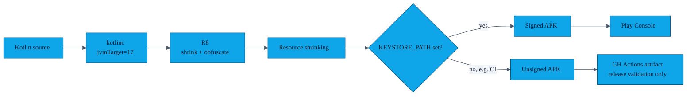

# Security model

> AURA aims to be **the most boring possible attack surface** for an exchange app: no servers, no analytics, no third-party SDKs that phone home, no opaque binary blobs. This page lists the cryptographic primitives we use, the threats they defend against, and — equally important — the threats we **do not** defend against.

---

## 1. Key material at a glance

```mermaid
%%{init: {'theme':'base','themeVariables':{
  'fontFamily':'ui-monospace, SFMono-Regular, Menlo, Monaco, monospace',
  'fontSize':'14px',
  'primaryColor':'#0EA5E9',
  'primaryTextColor':'#0F172A',
  'primaryBorderColor':'#075985',
  'lineColor':'#475569',
  'secondaryColor':'#F1F5F9',
  'tertiaryColor':'#FAFAF9',
  'clusterBkg':'#F8FAFC',
  'clusterBorder':'#CBD5E1'
},'flowchart':{'curve':'basis','nodeSpacing':40,'rankSpacing':50,'padding':12},'sequence':{'actorMargin':50,'boxMargin':10,'noteMargin':10,'messageMargin':35}}}%%
flowchart TB
    subgraph Long-lived["Long-lived (per device, lifetime of install)"]
        IDKEY[/Identity EC256 keypair<br/>alias: aura_device_identity<br/>Android Keystore (non-extractable)/]
        MK[/EncryptedSharedPreferences master key<br/>alias: aura_esp_master<br/>Android Keystore/]
    end

    subgraph Per-session["Per-session (lifetime: one exchange, then GC)"]
        EPH[/Ephemeral ECDH EC256 keypair<br/>JCE (in-memory only)/]
        AES[/AES-256 session key<br/>derived from ECDH/]
    end

    subgraph Stored
        GP[(Gesture feature vector<br/>EncryptedSharedPreferences)]
        DB[(Room v2<br/>profile + contacts + blocklist)]
        RPC[(Replay counter per idPub<br/>Room)]
    end

    IDKEY -- "signs challenges" --> AES
    EPH -- "ECDH" --> AES
    MK -- "encrypts" --> GP
    AES -- "AES-GCM" --> DB
```

| Key | Algorithm | Where stored | Lifetime |
|---|---|---|---|
| Device identity key | EC256 (NIST P-256) for ECDSA | Android Keystore, `aura_device_identity`, non-extractable | install lifetime |
| EncryptedSharedPreferences master | AES-256 | Android Keystore (`MasterKey.Builder`) | install lifetime |
| Per-session ECDH keypair | EC256 | JCE in-memory only | one exchange |
| Session AES key | AES-256 (GCM) | derived from ECDH, in-memory only | one exchange |
| Gesture feature vector | n/a (data, not a key) | `EncryptedSharedPreferences` | until user re-records or wipes |
| Replay counter | monotonically increasing 8-byte int | Room (per-peer-idPub row) | until peer is forgotten |

The actual implementation lives in [`CryptoUtils.kt`](../app/src/main/java/com/showerideas/aura/utils/CryptoUtils.kt).

---

## 2. Threats AURA explicitly defends against

| # | Threat | Defence |
|---|---|---|
| T1 | **Passive eavesdropping** on the BLE/Wi-Fi-P2P link | Profile is AES-256-GCM-encrypted with a per-session ECDH-derived key, *on top of* the encryption Nearby Connections already provides. |
| T2 | **Active MITM** that forwards Nearby connection requests | Identity challenge (PR-13): each side signs a 32-byte nonce with its long-lived Keystore EC key; the attacker can't forge an ECDSA signature without the private key. |
| T3 | **Replay** of a recorded session | 64-bit monotonically advancing counter inside the encrypted profile envelope is rejected if `≤` stored value for that peer (PR-15). |
| T4 | **Unwanted re-contact** by a peer you blocked | `BlockedEndpointDao` stores SHA-256 of the peer's identity public key; on every new endpoint discovery the service checks and instantly drops the connection (PR-14). |
| T5 | **Accidental exchange while phone is in pocket** | Gesture or biometric gate is required before the exchange service is started; volume-button triggers do not bypass it (PR-01). |
| T6 | **Brute-force unlock attempts** on the gesture | DTW match threshold + per-recording variance check + 3-strike cap before the exchange is auto-cancelled (PR-06, PR-11). |
| T7 | **OS-level backup leakage** | `android:allowBackup="false"` + `dataExtractionRules` + `fullBackupContent` are set so Auto-Backup and Device-to-Device transfer never copy the Room DB or gesture EncryptedSharedPreferences (manifest + `app/src/main/res/xml/`). |
| T8 | **Cleartext network egress** | `network_security_config` forbids cleartext for all domains, and AURA never opens an HTTP(S) connection in source. CI would catch a regression via the absence of `INTERNET` permission elevation. |
| T9 | **Code injection via incoming profile JSON** | `PayloadValidator` enforces a strict allow-list of fields, max-lengths, no HTML, and a recursion depth of 1 (PR-08 + reused in QR / direct). |
| T10 | **Reverse-engineering the release APK to extract release-only flags** | R8 + resource shrinking, `BuildConfig.ENABLE_LOGGING=false` on release, ProGuard rules keep only the public Nearby / Room / Hilt entry points. |

---

## 3. Threats we explicitly **don't** defend against

| # | Threat | Why we don't |
|---|---|---|
| N1 | **A user voluntarily sending their profile to a stranger.** | AURA is a *contact exchange* app — that's the feature. The blocklist is the remedy. |
| N2 | **A compromised peer device with root.** | If the other phone has root, anything you send to it can be exfiltrated. We can't fix the recipient. |
| N3 | **Long-range BLE direction-finding / presence inference.** | An attacker close enough to do this can also see the people in the room. The exchange is opt-in per-tap. |
| N4 | **Side-channel timing attacks on Android Keystore.** | We rely on the platform vendor's implementation; AURA has no opinion. |
| N5 | **Lost-phone scenario where the user did not set a screen lock.** | EncryptedSharedPreferences and Keystore both ultimately gate on the lockscreen; without one, the attacker has the device. |

---

## 4. Permission policy

AURA requests only what each Android version actually needs to scan and advertise via Nearby Connections, plus the camera for the QR fallback. Crucially:

- `BLUETOOTH_SCAN` is declared with **`neverForLocation`** so the platform does not surface a location prompt where avoidable.
- `ACCESS_FINE_LOCATION` is still requested for API < 31 (legacy BLE), and lint forces the `COARSE` companion. We never read geo location — the [privacy policy](../PRIVACY_POLICY.md) is unambiguous about this.
- `CAMERA` is `android:required="false"` so the app installs on cameraless devices; QR mode simply isn't offered there.
- `INTERNET` is **not requested.** This is enforced at install-time by Android.

Full justification per permission lives in [`features/03-permission-rationale.md`](features/03-permission-rationale.md).

---

## 5. Build / release hardening



- `app/proguard-rules.pro` keeps the Nearby Connections, Hilt, Room, Gson reflection points.
- The release signing block in `app/build.gradle.kts` is **env-var driven** so secrets never enter source control — CI leaves them blank intentionally to produce an unsigned validation APK, and the Play publishing pipeline supplies the real keystore.
- `network_security_config.xml`, `data_extraction_rules.xml`, and `backup_rules.xml` are committed under [`app/src/main/res/xml/`](../app/src/main/res/xml).

---

## 6. Audit / disclosure

If you find a security issue please **do not** open a public issue. Email `security@showerideas.app` (or open a private GitHub Security Advisory on this repo) with a description and ideally a reproduction. We will acknowledge within 72 hours.

Until v1.0.0 ships in the Play Store there is no formal CVE process; we will note any fixes in the relevant release notes and credit reporters who wish to be named.
