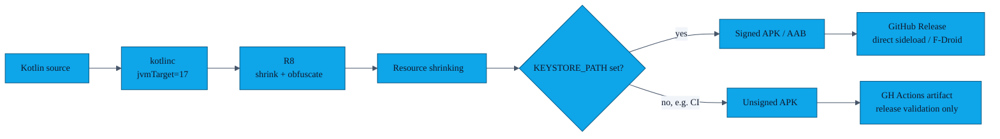

# Security model

> AURA aims to be **the most boring possible attack surface** for an exchange app: no servers, no analytics, no third-party SDKs that phone home, no opaque binary blobs. This page lists the cryptographic primitives we use, the threats they defend against, and — equally important — the threats we **do not** defend against.

---

## 1. Key material at a glance

```mermaid
%%{init: {'theme':'base','themeVariables':{
  'fontFamily':'ui-monospace, SFMono-Regular, Menlo, Monaco, monospace',
  'fontSize':'14px',
  'primaryColor':'#0EA5E9',
  'primaryTextColor':'#0F172A',
  'primaryBorderColor':'#075985',
  'lineColor':'#475569',
  'secondaryColor':'#F1F5F9',
  'tertiaryColor':'#FAFAF9',
  'clusterBkg':'#F8FAFC',
  'clusterBorder':'#CBD5E1'
},'flowchart':{'curve':'basis','nodeSpacing':40,'rankSpacing':50,'padding':12},'sequence':{'actorMargin':50,'boxMargin':10,'noteMargin':10,'messageMargin':35}}}%%
flowchart TB
    subgraph Long-lived["Long-lived (per device, lifetime of install)"]
        IDKEY[/Identity ML-DSA-65+ECDSA P-256 hybrid keypair<br/>alias: aura_device_identity<br/>Android Keystore (non-extractable)/]
        MK[/EncryptedSharedPreferences master key<br/>alias: aura_esp_master<br/>Android Keystore/]
    end

    subgraph Per-session["Per-session (lifetime: one exchange, then GC)"]
        EPH[/ML-KEM-768 + X25519 hybrid KEM session<br/>HybridKemEngine (in-memory only)/]
        AES[/AES-256 session key<br/>derived from KEM shared secret + HKDF-SHA256/]
    end

    subgraph Stored
        GP[(Gesture feature vector<br/>EncryptedSharedPreferences)]
        DB[(Room v2<br/>profile + contacts + blocklist)]
        NONCE[(Per-session nonce cache<br/>in-memory, purged every 5 min)]
    end

    IDKEY -- "signs challenges" --> AES
    EPH -- "ML-KEM-768+X25519 + HKDF" --> AES
    MK -- "encrypts" --> GP
    AES -- "AES-GCM" --> DB
```

| Key | Algorithm | Where stored | Lifetime |
|---|---|---|---|
| Device identity key | ML-DSA-65 + ECDSA P-256 hybrid (`HybridIdentityKey`) | Android Keystore, `aura_device_identity`, non-extractable | install lifetime |
| EncryptedSharedPreferences master | AES-256 | Android Keystore (`MasterKey.Builder`) | install lifetime |
| Per-session KEM material | ML-KEM-768 + X25519 hybrid (`HybridKemEngine.KemSession`) | JCE in-memory only | one exchange |
| Session AES key | AES-256-GCM | derived from KEM shared secret via HKDF-SHA256, in-memory only | one exchange |
| Gesture feature vector | n/a (data, not a key) | `EncryptedSharedPreferences` | until user re-records or wipes |
| Replay nonce cache | n/a | In-memory `ConcurrentHashSet` | purged every 5 min |

The actual implementation lives in [`CryptoUtils.kt`](../app/src/main/java/com/showerideas/aura/utils/CryptoUtils.kt).

---

## 2. Threats AURA explicitly defends against

| # | Threat | Defence |
|---|---|---|
| T1 | **Passive eavesdropping** on the BLE/Wi-Fi-P2P link | Profile is AES-256-GCM-encrypted with a key derived from a per-session **ML-KEM-768+X25519 hybrid KEM** (HKDF-SHA256), *on top of* the encryption Nearby Connections already provides. An attacker must break both X25519 and ML-KEM-768 simultaneously. |
| T2 | **Active MITM** that forwards Nearby connection requests (known-peer case) | Identity challenge: each side signs a 32-byte random nonce with its long-lived Keystore **ML-DSA-65 + ECDSA P-256 hybrid** key (`HybridIdentityKey`); the peer verifies the signature against the key stored in the TOFU registry. An attacker who does not hold the enrolled device's private key cannot produce a valid signature. **See §6 for the first-meet caveat.** |
| T3 | **Replay** of a captured and re-delivered ciphertext | Every encrypted profile carries a `_ts` Unix-millisecond timestamp (rejected if outside a ±60-second clock-skew window) and a `_nonce` UUID (rejected if the nonce was already seen in the current session). The nonce cache is purged every 5 minutes to bound memory. |
| T4 | **Unwanted re-contact** by a peer you blocked | `BlockedEndpointDao` stores the SHA-256 of the peer's identity public key (not the ephemeral endpoint ID, which changes each session). On every new connection the identity-key hash is checked before accepting. |
| T5 | **Accidental exchange while phone is in pocket** | Gesture (cosine-similarity gate at 0.88) or biometric is required before the exchange service is started; volume-button triggers do not bypass it. |
| T6 | **Gesture impersonation** | The cosine-similarity threshold (0.88) makes gesture auth an ergonomic gate — it prevents accidental exchanges, not determined attackers in range who can perform the same gesture class (~30–70% FAR for same-gesture cross-person pairs). The real security anchor is the long-lived Android Keystore ML-DSA-65+ECDSA hybrid identity key. See [docs/GESTURE_AUTH.md §6](GESTURE_AUTH.md) for the quantified FAR analysis. |
| T7 | **OS-level backup leakage** | `android:allowBackup="false"` + `dataExtractionRules` + `fullBackupContent` are set so Auto-Backup and Device-to-Device transfer never copy the Room DB or gesture EncryptedSharedPreferences. |
| T8 | **Cleartext network egress** | `network_security_config` forbids cleartext for all domains. The only outbound HTTPS call is the optional QR relay path (`RelayClient.kt`) which uses HttpURLConnection over HTTPS exclusively — no plaintext profile data ever leaves the device unencrypted. `INTERNET` permission is intentionally declared and documented in the manifest. |
| T9 | **Heap exhaustion via crafted profile payload** | `PayloadValidator` enforces per-field length caps (500 chars for displayName/email/phone/note) and a pre-decryption size gate of 64 KB on the encrypted blob. An oversized payload is dropped without touching the heap further (). |
| T10 | **Reverse-engineering the release APK** | R8 + resource shrinking, `BuildConfig.ENABLE_LOGGING=false` on release, ProGuard rules keep only the public Nearby / Room / Hilt / MediaPipe entry points. |

---

## 3. Threats we explicitly **don't** defend against

| # | Threat | Why we don't |
|---|---|---|
| N1 | **A user voluntarily sending their profile to a stranger.** | AURA is a *contact exchange* app — that's the feature. The blocklist is the remedy. |
| N2 | **A compromised peer device with root.** | If the other phone has root, anything you send to it can be exfiltrated. We can't fix the recipient. |
| N3 | **Long-range BLE direction-finding / presence inference.** | An attacker close enough to do this can also see the people in the room. The exchange is opt-in per-tap. |
| N4 | **Side-channel timing attacks on Android Keystore.** | We rely on the platform vendor's implementation; AURA has no opinion. |
| N5 | **Lost-phone scenario where the user did not set a screen lock.** | EncryptedSharedPreferences and Keystore both ultimately gate on the lockscreen; without one, the attacker has the device. |

---

## 4. Permission policy

AURA requests only what each Android version actually needs to scan and advertise via Nearby Connections, plus the camera for gesture auth and QR fallback. Crucially:

- `BLUETOOTH_SCAN` is declared with **`neverForLocation`** so the platform does not surface a location prompt where avoidable.
- `ACCESS_FINE_LOCATION` is still requested for API < 31 (legacy BLE), and lint forces the `COARSE` companion. We never read geo location — the [privacy policy](../PRIVACY_POLICY.md) is unambiguous about this.
- `CAMERA` is `android:required="false"` so the app installs on cameraless devices; QR mode and gesture auth simply aren't offered there.
- `INTERNET` is requested **only for the QR relay path.** The relay transmits only AES-256-GCM ciphertext; no plaintext profile data leaves the device over the network. Core BLE/Wi-Fi-P2P exchange paths remain fully offline. The manifest comment documents the rationale. All other exchange paths are unaffected.

Full justification per permission lives in [`features/03-permission-rationale.md`](features/03-permission-rationale.md).

---

## 5. Build / release hardening



- `app/proguard-rules.pro` keeps the Nearby Connections, Hilt, Room, Gson, and MediaPipe reflection/JNI entry points.
- The release signing block in `app/build.gradle.kts` is **env-var driven** (`KEYSTORE_BASE64`, `KEYSTORE_STORE_PASSWORD`, `KEYSTORE_KEY_ALIAS`, `KEYSTORE_KEY_PASSWORD`) so secrets never enter source control — CI leaves them blank intentionally to produce an unsigned validation APK; the release pipeline supplies the real keystore from GitHub Secrets.
- `network_security_config.xml`, `data_extraction_rules.xml`, and `backup_rules.xml` are committed under [`app/src/main/res/xml/`](../app/src/main/res/xml).
- CI runs `check-mediapipe-classes` (apkanalyzer) and `check-apk-size` on every PR. The `check-no-internet` gate was removed when `INTERNET` was intentionally added for QR relay — the manifest comment documents the rationale.

---

## 6. TOFU first-meet gap and SAS mitigation

**The TOFU (Trust On First Use) problem:** When two AURA users meet for the first time, neither phone has seen the other's identity public key before. An attacker who can intercept the Nearby Connections session at exactly that moment could substitute their own identity key. After first use, the TOFU registry pins the key and detects future substitution attempts (T2 above). But on that very first exchange, the identity challenge/response cannot protect against a key-substituting MITM.

**Mitigation — Short Authentication String (SAS):** `SasVerifier.deriveFromSharedSecret()` derives a 6-digit decimal number directly from the **KEM shared secret** established during the ML-KEM-768+X25519 handshake. A MITM who substitutes their own key produces a different KEM shared secret and therefore a different SAS:

```
SAS = big_endian_24bit(SHA-256(kemSharedSecret)) % 1_000_000
      → zero-padded to 6 digits, e.g. "042731"
```

Both phones display the same number. The user detects a MITM by comparing the number verbally before confirming the exchange.

**Implementation:** `SasVerifier.kt` is in `utils/`. The primary path is `deriveFromSharedSecret(ByteArray)` — called by `NearbyExchangeService` after the hybrid KEM handshake completes. The legacy `derive(PublicKey, PublicKey)` path (SPKI key concatenation) is retained for NFC-bootstrapped classical ECDH sessions only. Unit tests in `SasVerifierTest.kt` cover: `deriveFromSharedSecret` determinism, format (always 6 digits, always < 10⁶), and cross-secret uniqueness.

**UI integration status:** The SAS dialog is wired into `NearbyExchangeService` — `ACTION_CONFIRM_SAS` / `ACTION_ABORT_SAS` intents drive the flow; `pendingSasEndpointId` gates profile exchange until user confirmation. Fully integrated as of v4.0.0.

**Realistic threat level:** The first-meet MITM attack requires the attacker to be physically in BLE/Wi-Fi-P2P range, intercept both sides of the Nearby handshake simultaneously, and do this in the short window before the user taps "Done". This is operationally very hard. The SAS is defence-in-depth, not the primary security anchor.

---

## 7. Audit / disclosure

If you find a security issue please **do not** open a public issue. Open a private [GitHub Security Advisory](https://github.com/showerideas/Aura/security/advisories/new) with a description and ideally a reproduction. We will acknowledge within 72 hours.

We note any fixes in the relevant release notes and credit reporters who wish to be named.
