# Showcase

> Screenshots and demo clips of AURA running on real devices.
> Drop new captures into `docs/assets/` and reference them here.

---

## 🎬 The 60-second demo

```mermaid
%%{init: {'theme':'base','themeVariables':{
  'fontFamily':'ui-monospace, SFMono-Regular, Menlo, Monaco, monospace',
  'fontSize':'14px',
  'primaryColor':'#0EA5E9',
  'primaryTextColor':'#0F172A',
  'primaryBorderColor':'#075985',
  'lineColor':'#475569',
  'clusterBkg':'#F8FAFC',
  'clusterBorder':'#CBD5E1'
},'flowchart':{'curve':'basis','nodeSpacing':30,'rankSpacing':36,'padding':12}}}%%
flowchart LR
    A["📱 Install<br/>APK"]:::user --> B["📝 Fill<br/>Profile"]:::ui
    B --> C["✋ Record<br/>Gesture"]:::ui
    C --> D["🔓 Activate<br/>vol&nbsp;▼&nbsp;×&nbsp;3"]:::service
    D --> E["✨ Gesture<br/>Match"]:::service
    E --> F["📇 Contact<br/>Saved"]:::data

    classDef user fill:#6E56CF,color:#FFFFFF,stroke:#3D2C7A,stroke-width:2px
    classDef ui fill:#8B5CF6,color:#FFFFFF,stroke:#5B21B6,stroke-width:2px
    classDef service fill:#0EA5E9,color:#FFFFFF,stroke:#075985,stroke-width:2px
    classDef data fill:#10B981,color:#FFFFFF,stroke:#065F46,stroke-width:2px
```



---

## 📸 Screen-by-screen tour

> 🚧 **Captures pending** — see [`docs/assets/CAPTURE_GUIDE.md`](assets/CAPTURE_GUIDE.md) for how to produce them.

| Screen | When you see it | Asset slot |
|---|---|---|
| **Onboarding** (3 cards: what / why / how) | First launch | `docs/assets/01-onboarding.png` |
| **Permission rationale** sheet | First time AURA needs Bluetooth / Nearby | `docs/assets/02-permission-rationale.png` |
| **Profile** edit | Tap *Edit profile* on Home | `docs/assets/03-profile-edit.png` |
| **Gesture record** | Profile → *Record gesture* | `docs/assets/04-gesture-record.png` |
| **Home** (idle) | App at rest | `docs/assets/05-home-idle.png` |
| **Home** (pulsing, activated) | After triple-press vol ▼ | `docs/assets/06-home-pulse.png` |
| **Exchange gate** (gesture prompt) | Activation succeeded | `docs/assets/07-exchange-gate.png` |
| **Exchange success** toast | Both phones matched | `docs/assets/08-exchange-success.png` |
| **Contacts** list | Tab → *Contacts* | `docs/assets/09-contacts-list.png` |
| **Contact detail** bottom sheet | Tap a contact | `docs/assets/10-contact-detail.png` |
| **QR fallback** | Home → *QR* | `docs/assets/11-qr-fallback.png` |
| **Room mode** (host) | Home → *Room* → *Host* | `docs/assets/12-room-host.png` |
| **Settings** | Home → ⚙️ | `docs/assets/13-settings.png` |
| **Blocked Devices** | Settings → *Blocked devices* | `docs/assets/14-blocked.png` |

Once images land, replace each row's *Asset slot* cell with:

```markdown
| **Onboarding** | First launch |  |
```

---

## 🎥 Demo GIF

> 🚧 Pending — produce a ≤ 6 s loop showing the full `wake → gesture → exchange` happy path, drop at `docs/assets/aura-demo.gif`, then add the snippet below to the top of the main [`README.md`](../README.md#how-it-works-one-diagram).

```markdown
<p align="center">
  
</p>
```

---

## 📐 Asset spec

| Attribute | Requirement |
|---|---|
| Format | PNG (24-bit) or animated GIF |
| Width | 360 px (matches the table) or 1080 px for hero |
| File size | < 250 KB per still, < 4 MB per GIF |
| Device frame | None — raw screenshot, no chrome |
| Status bar | Cleaned via [`demo-mode`](https://developer.android.com/training/testing/other-components/ui-automator#demo-mode) (12:00, full battery, full signal) |
| PII | None — use placeholder names, scrub timestamps |

See [`docs/assets/CAPTURE_GUIDE.md`](assets/CAPTURE_GUIDE.md) for the full step-by-step.
