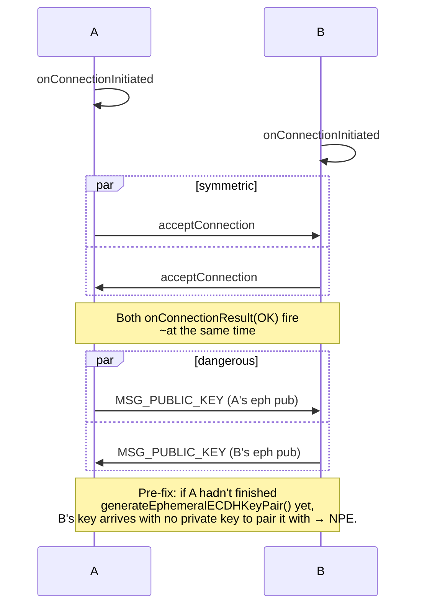

# PR-02 — ECDH race-condition fix

> Two devices that both call `requestConnection` at the same instant used to deadlock: each side would `acceptConnection` before its own ECDH key had been generated, so the first `MSG_TYPE_PUBLIC_KEY` arrived into a `null` private-key slot.

---

## The race



---

## The fix

`NearbyExchangeService` now **generates the ephemeral keypair synchronously in `onConnectionInitiated`**, *before* calling `acceptConnection`. The first thing sent on the channel afterwards is our public key, and the field that receives the peer's public key is guarded by a `lateinit` plus a small `Mutex` so concurrent calls from the Nearby callback thread can't observe a half-initialised state.

```kotlin
override fun onConnectionInitiated(endpointId: String, info: ConnectionInfo) {
    sessionState.ourEphemeralKeyPair = CryptoUtils.generateEphemeralECDHKeyPair() // ← moved here
    connectionsClient.acceptConnection(endpointId, payloadCallback)
}
```

---

## Tests

`app/src/test/.../NearbyExchangeServiceGateTest.kt` covers the symmetric-init case by driving both callbacks on separate threads and asserting that the resulting AES key matches on both sides.
