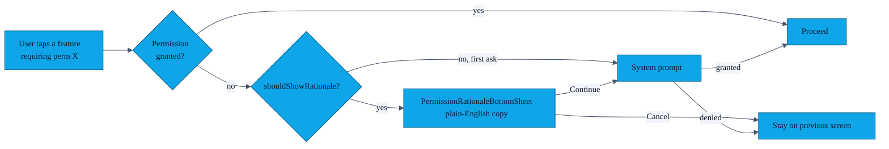

# PR-03 — Permission rationale bottom sheet

> Android grants BLE / Wi-Fi / Camera / Notification permissions through a system dialog that gives the user *no context*. PR-03 inserts our own `BottomSheetDialogFragment` before the system prompt so users know what each permission is for, and can see what the app will not do.

---

## Flow

---

## Permissions covered

| Permission | What we tell the user |
|---|---|
| `BLUETOOTH_SCAN` + `BLUETOOTH_ADVERTISE` + `BLUETOOTH_CONNECT` (API 31+) | "AURA finds the phone in front of you over Bluetooth Low Energy. We do not scan for or store location." |
| `ACCESS_FINE_LOCATION` (legacy BLE, API ≤ 30) | "Older Androids require this for any BLE scan. AURA does not read your GPS." |
| `NEARBY_WIFI_DEVICES` (API 33+) | "Used by Nearby Connections when the link upgrades from Bluetooth to Wi-Fi for faster avatar transfer." |
| `CAMERA` | "Optional — only used by the QR-code fallback exchange." |
| `POST_NOTIFICATIONS` (API 33+) | "So the volume-button listener can stay alive in the background." |

---

## File pointers

- UI: `app/src/main/java/com/showerideas/aura/ui/PermissionRationaleBottomSheet.kt`
- Layout: `app/src/main/res/layout/bottom_sheet_permission_rationale.xml`
- Strings: `permission_rationale_*` in `app/src/main/res/values/strings.xml`
- Justifications also documented in [`SECURITY.md`](../SECURITY.md#4-permission-policy) and `PRIVACY_POLICY.md`.

---

## Tests

UI test for the rationale → system-prompt hand-off is **pending** (instrumentation job not yet wired into CI — see [`AUDIT.md`](../AUDIT.md)). Manual QA covers it.
