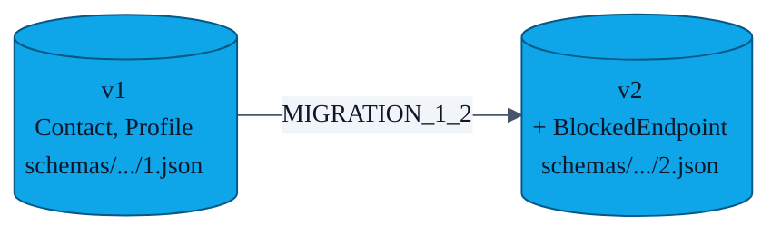

# PR-04 — Room schema migrations

> The first scaffold used `fallbackToDestructiveMigration()`, which is fine until a single user has irreplaceable contacts on disk. PR-04 turns on `exportSchema = true`, commits the schemas, and writes an explicit migration.

---

## Schema timeline



`MIGRATION_1_2` adds the `blocked_endpoints` table; existing rows are untouched.

```kotlin
val MIGRATION_1_2 = object : Migration(1, 2) {
    override fun migrate(db: SupportSQLiteDatabase) {
        db.execSQL("""
            CREATE TABLE IF NOT EXISTS blocked_endpoints (
                idPubFingerprint TEXT NOT NULL PRIMARY KEY,
                blockedAt INTEGER NOT NULL,
                displayName TEXT
            )
        """.trimIndent())
    }
}
```

---

## Build-system wiring

`app/build.gradle.kts` exports the schema directory and exposes it to `androidTest`:

```kotlin
javaCompileOptions {
    annotationProcessorOptions {
        arguments["room.schemaLocation"] = "$projectDir/schemas"
    }
}
sourceSets {
    getByName("androidTest").assets.srcDir("$projectDir/schemas")
}
```

This lets `MigrationTestHelper` open the historical schema JSON and replay the migration.

---

## Tests

`app/src/androidTest/.../MigrationTest.kt` walks the `1 → 2` path against the committed schema and asserts that the seed rows survive and the new table is present and queryable.

---

## What v3 will look like

Following the same pattern, any future entity (e.g. a "tags" table) lands as `MIGRATION_2_3` in `Migrations.kt` plus a new schema JSON, plus a new `MigrationTest.migrateAll()` row.
