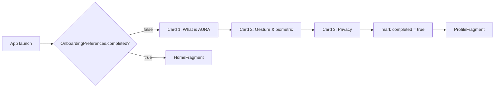

# PR-05 — First-launch onboarding

> Three swipeable cards on first launch explain (a) what AURA is, (b) how the gesture works, (c) that the data never leaves the device. After the last card the user lands on the Profile screen to set up their card.

---

## Flow

---

## Implementation

- **UI:** `OnboardingFragment` + `ViewPager2`, with a custom indicator drawable (`onboarding_dot_selector.xml`).
- **State:** `OnboardingPreferences` (DataStore `Preferences`), single `completed: Boolean` key.
- **Hand-off:** `MainActivity` checks the flag in `onCreate()` and chooses the start destination of the nav graph.

---

## Strings

`onboarding_card1_title`, `onboarding_card1_body`, … `onboarding_card3_body`, plus `onboarding_skip`, `onboarding_done`.

---

## Tests

Manual QA only — no automated path yet (Espresso would need the instrumentation CI job, see [`AUDIT.md`](../AUDIT.md)).
