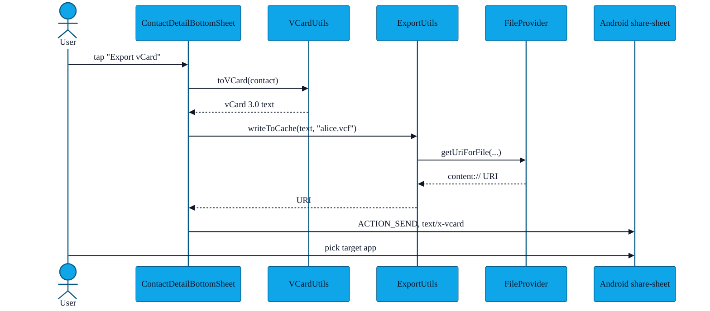

# PR-07 — vCard export

> Every contact AURA receives is exportable as a `.vcf` file you can hand to the system address book or any other app via `ACTION_SEND`.

---

## Flow



---

## vCard format

The output is **vCard 3.0**, UTF-8, with each populated field becoming a line:

```vcard
BEGIN:VCARD
VERSION:3.0
FN:Alice Example
N:Example;Alice;;;
TEL;TYPE=CELL:+1 555 0100
EMAIL:alice@example.com
ORG:Example Co
TITLE:Engineer
URL:https://alice.example
NOTE:Met at the Berlin meetup
END:VCARD
```

The avatar, if present, is base64-encoded into a `PHOTO;ENCODING=b;TYPE=JPEG:` line.

---

## File pointers

- `app/src/main/java/com/showerideas/aura/utils/VCardUtils.kt`
- `app/src/main/java/com/showerideas/aura/utils/ExportUtils.kt`
- `app/src/main/res/xml/file_provider_paths.xml` (cache directory exposed via FileProvider)
- Manifest `<provider>` block

---

## Tests

`app/src/test/.../VCardUtilsTest.kt` checks:

- Required fields (`FN`, `END:VCARD`) always present.
- Optional fields are skipped (not emitted as blank lines).
- Newlines inside `NOTE` are escaped as `\n`.
- Non-ASCII characters survive (UTF-8).
