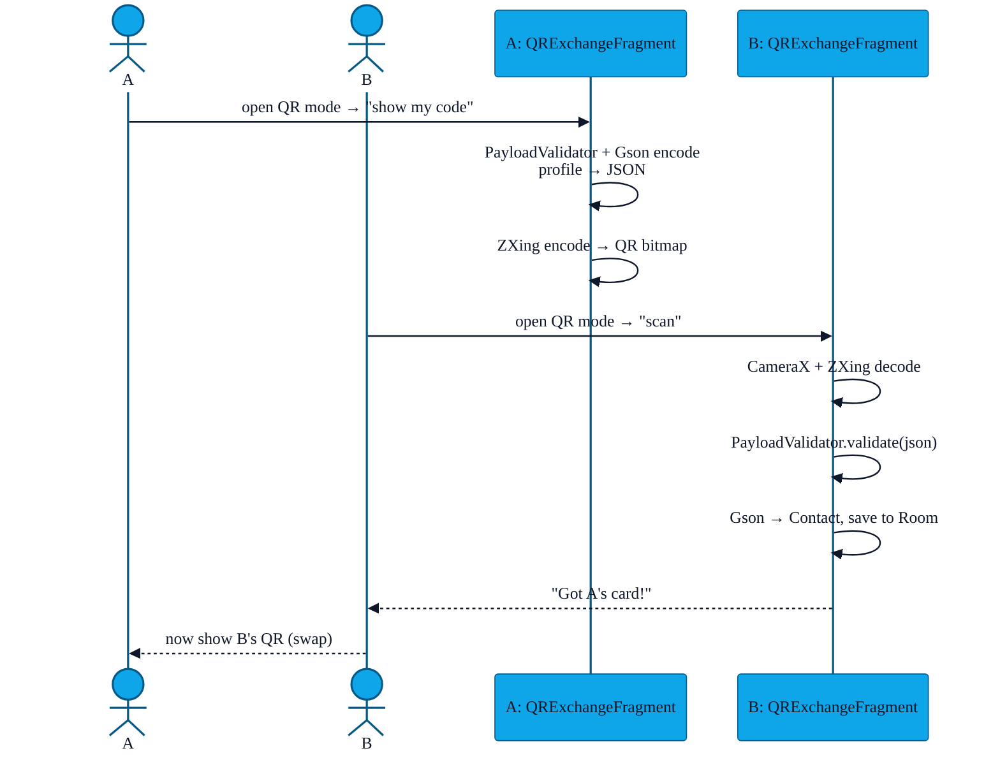

# PR-08 — QR-code fallback exchange

> Some venues (cinemas, corporate buildings, faraday-shielded rooms) block BLE or Wi-Fi P2P entirely. PR-08 adds a degraded but always-available exchange path: encode the profile as a QR code and let the other phone scan it.

---

## Flow

The hand-off is **two-shot** (A's QR scanned by B, then B's QR scanned by A); the UI walks the user through it.

---

## Why QR data is treated as untrusted

The QR pixels are an arbitrary input. We never `eval`, but `PayloadValidator` still enforces:

- A strict JSON schema (`displayName` required, all others optional)
- Per-field maximum lengths
- No raw HTML / control characters
- No nested objects deeper than 1
- Maximum total size of 4 KB (a QR code can fit ~3 KB at error-correction level M)

If validation fails the contact is **not** saved and the UI surfaces "Couldn't read that code".

---

## File pointers

- `app/src/main/java/com/showerideas/aura/ui/qr/QRExchangeFragment.kt`
- `app/src/main/java/com/showerideas/aura/ui/qr/QRExchangeViewModel.kt`
- `app/src/main/java/com/showerideas/aura/utils/PayloadValidator.kt`
- ZXing-embedded dependency in `libs.versions.toml` (`zxing-android-embedded`)

---

## Tests

`PayloadValidator` is heavily unit-tested:

- Oversize string rejected.
- Unknown field rejected (strict schema).
- Embedded `<script>` rejected.
- Valid minimal payload accepted.

---

## Limitations

- QR mode has **no** ECDH and **no** challenge–response — the camera is the channel, both phones see the same plaintext. This is acceptable given the threat model (you only scan codes from someone in front of you).
- Avatars are **not** sent via QR — too many bytes. The avatar field is dropped from the JSON before encoding.
