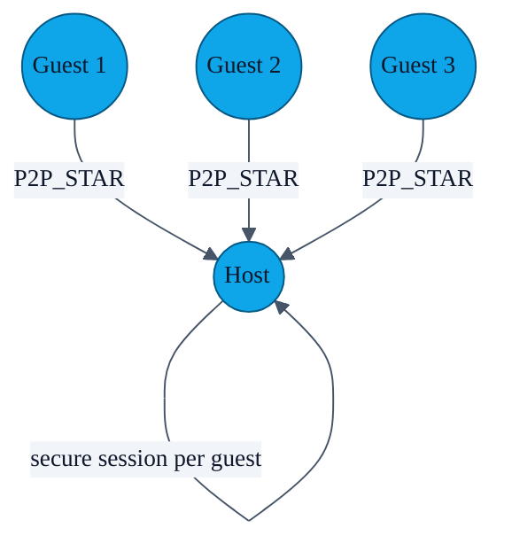

# PR-09 — Room mode (1 host : N guests)

> The default exchange is 1-to-1. For meetups, weddings, and small conferences PR-09 adds a "Room" mode where one device is the **host** and any number of guests can stream their cards to it in sequence — perfect for an organiser collecting attendees.

---

## Topology

The host calls `NearbyExchangeService.startRoomHost(context)`, which starts the service in `P2P_STAR` strategy and accepts every incoming guest until the host taps **Stop**.

Each guest still does its **own** ECDH and challenge with the host, so the host gets *N* independent secure sessions, not a broadcast. The host's profile is delivered to each guest as they connect.

---

## UI

- Host: `RoomExchangeFragment` with a live counter ("3 guests onboarded") and a Stop button.
- Guest: same fragment, switched to guest mode → searches for a host name, then walks the same gesture/biometric gate before sending its profile.

---

## File pointers

- `app/src/main/java/com/showerideas/aura/ui/room/RoomExchangeFragment.kt`
- `app/src/main/java/com/showerideas/aura/ui/room/RoomExchangeViewModel.kt`
- `NearbyExchangeService.startRoomHost()` / `startRoomGuest()` companion functions.

---

## Tests

Manual QA. A full instrumentation harness for room mode would need at least three connected devices, which the current emulator-runner plans do not cover.
