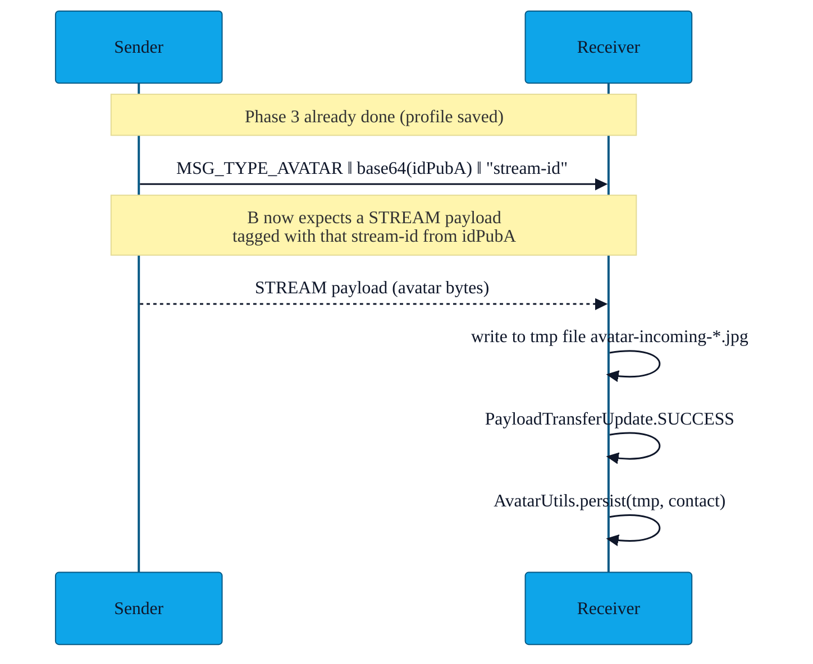

# PR-10 — Avatar STREAM sharing

> Avatars can be up to a few hundred kilobytes — too much for a Nearby Connections `BYTES` payload (4 KB-ish limit, blocks the channel). PR-10 sends them as a `STREAM` payload that runs in parallel.

---

## Two-step handshake

- The **announce** message tells the receiver *who* the avatar belongs to (idPub fingerprint) and *which* stream id to expect.
- The **STREAM** is a `Payload.Type.STREAM` — Nearby Connections schedules it on its own channel.
- The receiver writes incoming bytes to a temp file named `avatar-incoming-*.jpg` and only promotes it into the contact row when the transfer completes successfully.

---

## Cleanup safety (FIX-C)

If the peer drops in the middle of a STREAM, the receiver could leak partial `avatar-incoming-*.jpg` files in the cache directory. `NearbyExchangeService.onDisconnected` sweeps these files on each disconnect. The sweep is bounded to its own filename pattern so we never delete unrelated cache content.

---

## File pointers

- `app/src/main/java/com/showerideas/aura/utils/AvatarUtils.kt` — encode (sender) + persist (receiver) helpers.
- `NearbyExchangeService.handleIncomingAvatarStream` — STREAM-payload sink.

---

## Limits

- Max avatar size: **256 KB** (rejected silently above that — the profile still saved, just without the photo).
- Format: JPEG.
- Avatars are not sent in **QR mode** at all (see [`features/08-qr-fallback.md`](08-qr-fallback.md)).
