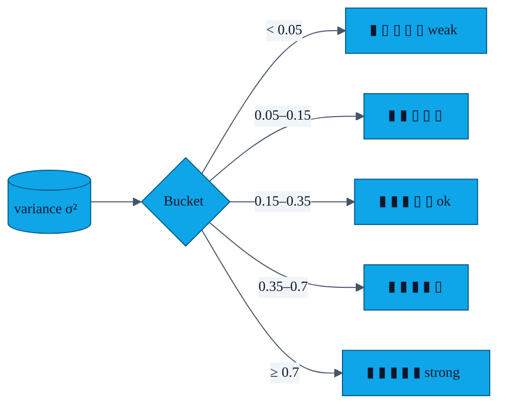

# PR-11 — Gesture strength indicator

> The Profile screen now shows a five-bar meter under "Gesture Authentication". It uses the variance value from PR-06 to encourage users to record a richer motion.

---

## Mapping

The thresholds are the same ones referenced in [`docs/GESTURE_AUTH.md`](../GESTURE_AUTH.md#4-strength-meter-pr-11).

---

## UI

- Drawable: `app/src/main/res/drawable/gesture_strength_bar.xml` — a rounded-rect background each segment uses.
- Layout: the five `View`s sit horizontally in `fragment_profile.xml` under id `gesture_strength_bars`.
- Tint: filled segments use `?colorPrimary`; empty ones use a low-alpha gray.
- The label "gesture strength" is in `strings.xml` under `profile_gesture_strength_label`.

---

## When it updates

- After every `savePattern()` call.
- Live during recording? **No** — the meter only refreshes on save, because in-progress variance jitters wildly. Showing it then would be visually distracting and could mislead users into thinking they need to "max it out" mid-motion.

---

## Tests

Inherits coverage from `GestureMatchTest.kt`'s variance assertions.
