# PR-12 — Favourites + notes per contact

> Two small but high-value additions to the `Contact` entity: a `favorite: Boolean` and a `note: String` field, both editable from `ContactDetailBottomSheet`.

---

## Data flow

```mermaid
%%{init: {'theme':'base','themeVariables':{
  'fontFamily':'ui-monospace, SFMono-Regular, Menlo, Monaco, monospace',
  'fontSize':'14px',
  'primaryColor':'#0EA5E9',
  'primaryTextColor':'#0F172A',
  'primaryBorderColor':'#075985',
  'lineColor':'#475569',
  'secondaryColor':'#F1F5F9',
  'tertiaryColor':'#FAFAF9',
  'clusterBkg':'#F8FAFC',
  'clusterBorder':'#CBD5E1'
},'flowchart':{'curve':'basis','nodeSpacing':40,'rankSpacing':50,'padding':12},'sequence':{'actorMargin':50,'boxMargin':10,'noteMargin':10,'messageMargin':35}}}%%
flowchart LR
    UI[ContactDetailBottomSheet] -- "tap ⭐ / save note" --> VM[ContactDetailViewModel]
    VM -- "setFavorite / setNote" --> Repo[ContactRepository]
    Repo -- "DAO update" --> DB[(Room: contacts row)]
    DB -- "Flow<List<Contact>>" --> List[ContactsFragment list]
    List -- "⭐ icon + sort" --> User((User))
```

The contact list (`ContactsFragment`) sorts favourites to the top via a SQL `ORDER BY favorite DESC, displayName ASC` in `ContactDao.getAll()`.

---

## UI

- A filled / outlined star in the bottom sheet header toggles favourite.
- A multi-line `TextInputEditText` for the note, saved on focus-loss.
- The contacts list shows a small ⭐ next to favourites and surfaces the note's first line as a subtitle if present.

---

## Why notes are stored only locally

The `note` field is **never** transmitted in an exchange — it is a private aide-mémoire on the receiver's device only. It is excluded from:

- the JSON profile encoded for direct exchange,
- the QR payload,
- the vCard export (no `NOTE` line is emitted from this field; vCard's `NOTE` is reserved for the contact's own bio).

---

## Tests

`ContactDaoTest.kt` (instrumentation) covers:

- `setFavorite(id, true)` updates exactly one row.
- `setNote(id, "...")` persists a UTF-8 string with newlines intact.
- The flow emits a new list with favourites first after either change.
