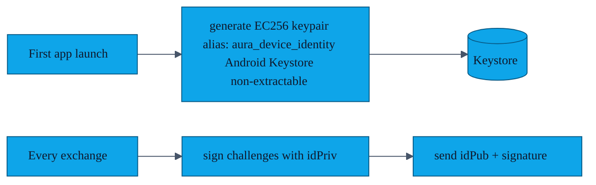
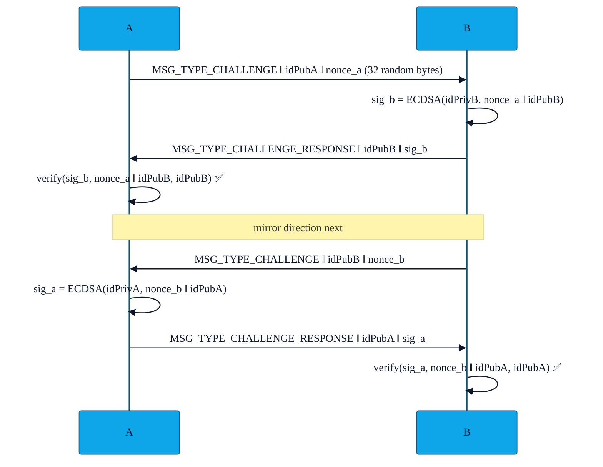

# PR-13 — Device-identity challenge

> Even with ECDH, a MITM that sits between two phones and relays packets could in principle swap profiles. PR-13 adds a long-lived, hardware-backed identity key on each device and a challenge–response that proves the peer is the same device on every encounter.

---

## Key lifecycle

Because the private key is created `setUserAuthenticationRequired(false)` *and* `setIsStrongBoxBacked(true)` (where available), it is bound to the device — uninstalling AURA destroys it permanently.

---

## Handshake

Either side that fails to verify drops the connection and surfaces "Aborted: impersonation" in the UI.

---

## What this gets us

- **MITM resistance.** A relay cannot forge `sig_b` without `idPrivB`.
- **Cross-session continuity.** The `idPub` fingerprint is stored on every received `Contact` row, so re-encountering the same person yields a *match* even after their display name changes. This also feeds the blocklist ([`features/14-blocklist.md`](14-blocklist.md)) and the replay window ([`features/15-replay-protection.md`](15-replay-protection.md)).

---

## File pointers

- `CryptoUtils.getOrCreateDeviceIdentityKeyPair()` — Keystore generation.
- `CryptoUtils.sign()` / `verify()` — ECDSA.
- `NearbyExchangeService.sendChallenge()`, `handleIncomingChallenge()`, `handleChallengeResponse()`.

---

## Tests

`ReplayProtectionTest.kt` exercises the signing/verifying path as a side-effect of its own scenarios.
