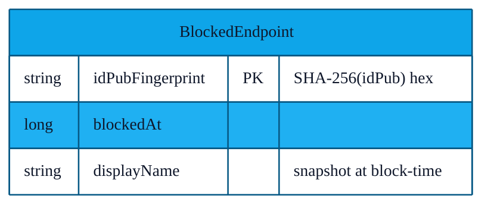
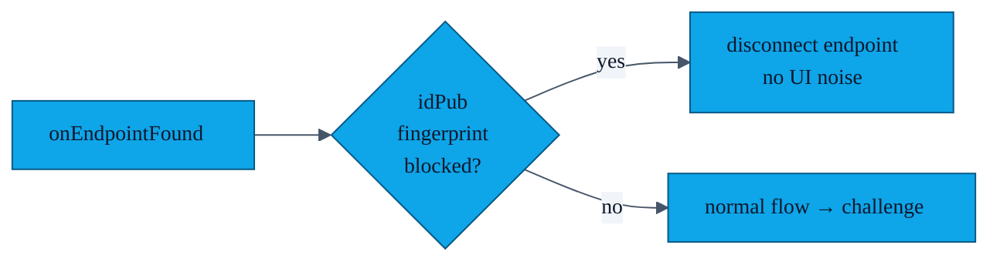

# PR-14 — Endpoint blocklist (DB schema v2)

> Users can mark a contact as "block" — that peer's identity-key fingerprint is then auto-rejected on any future discovery. This is the user-facing reason the DB schema bumped to v2.

---

## Data shape

The fingerprint is the same SHA-256 we stamp on every received `Contact` (see [`features/13-device-challenge.md`](13-device-challenge.md)), so the join is on a stable identifier even if the peer changes their display name.

---

## Enforcement point

Crucially, the blocked endpoint is dropped **after** the challenge so we *know* it's really the same device — endpoint IDs from Nearby Connections rotate per session and can't be trusted directly.

---

## UI

- **Block:** "Block this person" from `ContactDetailBottomSheet`. Toast: "Won't appear in future exchanges."
- **Unblock:** `BlockedDevicesFragment` lists every blocked entry with the snapshotted name and the date; tap to unblock.

---

## File pointers

- Entity: `app/src/main/java/com/showerideas/aura/model/BlockedEndpoint.kt`
- DAO: `app/src/main/java/com/showerideas/aura/data/local/BlockedEndpointDao.kt`
- Repository: `app/src/main/java/com/showerideas/aura/data/BlocklistRepository.kt`
- UI: `ui/settings/BlockedDevicesFragment.kt` + `BlockedDevicesAdapter.kt`
- Migration: see [`features/04-room-migrations.md`](04-room-migrations.md)

---

## Tests

`app/src/androidTest/.../BlockedEndpointDaoTest.kt`:

- Insert + `isBlocked()` round-trip.
- Delete by primary key.
- Flow emits updates after insert / delete.
