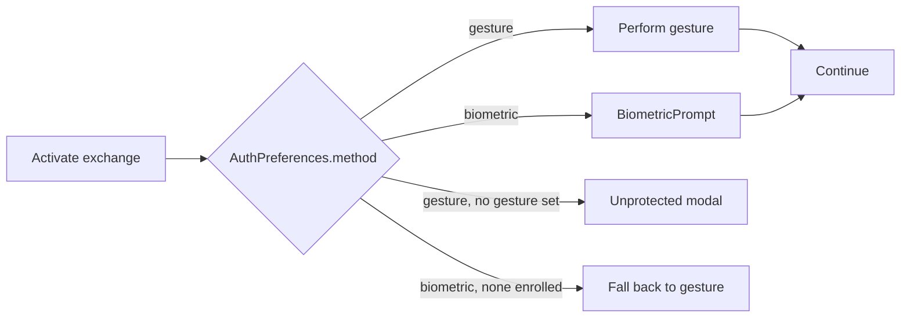

# PR-16 — Biometric unlock as an alternative gate

> The gesture is the default unlock, but many users would rather use the fingerprint scanner or face unlock they already trust. PR-16 lets either method pass the exchange gate.

---

## Decision tree

The user picks gesture vs biometric in **Settings → Authentication method**. Biometric defaults to *off* — gesture is what AURA was designed for, biometric is a courtesy.

---

## Implementation

- `BiometricAuthHelper.authenticate(activity, onSuccess, onError)` wraps `androidx.biometric.BiometricPrompt`.
- Strong, weak, and device-credential authenticators are all allowed (`BIOMETRIC_STRONG or DEVICE_CREDENTIAL`) so users without enrolled biometrics can fall back to PIN/pattern.
- The "verified" signal is the same `NearbyExchangeService.markGestureVerified()` call — the service does not care which mechanism cleared the gate.

---

## Why not strictly STRONG?

`BIOMETRIC_STRONG` excludes face unlock on many older devices. Forcing it would lock those users out of the alternative entirely. The privacy/security trade-off here is local-only — the biometric is just a gate to *our* exchange flow, not a key in the keystore-backed crypto.

---

## File pointers

- `app/src/main/java/com/showerideas/aura/auth/BiometricAuthHelper.kt`
- Preference: `AuthPreferences.method` (DataStore)
- Settings UI: `ui/settings/SettingsFragment.kt`

---

## Tests

Wired but **not** in CI yet — the BiometricPrompt cannot be driven from a JVM unit test, and the instrumentation emulator job is still a follow-up (see [`AUDIT.md`](../AUDIT.md)). Manual QA on Pixel + Samsung devices.
