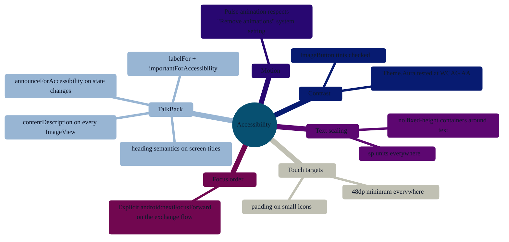

# PR-17 — Accessibility audit

> AURA is built to be used by people with vision, motor, and cognitive impairments. PR-17 walked every screen against Google's accessibility-scanner checklist and fixed the findings.

---

## What changed

---

## High-impact fixes

| Screen | What was fixed |
|---|---|
| Home | The big Activate button now announces its own state ("Activate AURA, button" → "Searching for nearby AURA users…") and exposes the gesture record button as a heading. |
| Profile | Every `TextInputLayout` gets a `labelFor` so TalkBack reads the field name, not just the hint. The "Share this field" switches have `contentDescription` that includes the field name. |
| Exchange | The 3-strike status announces dynamically via `announceForAccessibility`. The gesture hint area is a single focusable container so TalkBack doesn't read it word by word. |
| Contacts list | Each row exposes name, company, and "favourite" as one accessibility node. The star button is a separate focusable target with toggle semantics. |
| Settings & Blocked devices | Switch rows expose `contentDescription` matching their text label. |

---

## What is **not** done yet

- A high-contrast `values-night/` themed variant exists but a "Dynamic Color" / Material You opt-in is not implemented.
- Automated accessibility tests (via `AccessibilityChecks`) are wired but not yet failing the build — they currently log warnings only.

---

## How to test

1. Settings → Accessibility → TalkBack on.
2. Walk through Onboarding → Profile → Activate → Contacts.
3. Every interactive element should announce a label *and* a role.
4. Run the official **Accessibility Scanner** from the Play Store against each screen; no items should be flagged at Severity ≥ Medium.
