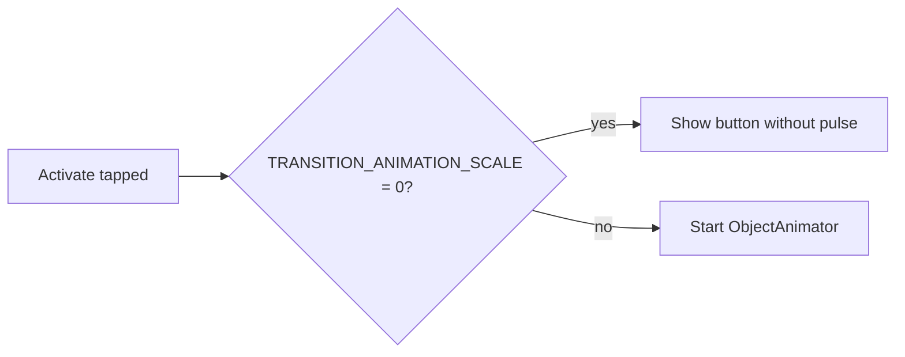

# PR-18 — Pulsing activation animation

> Visual feedback that AURA is "live and searching". The Activate button radiates a soft circular pulse while the exchange service is advertising or discovering.

---

## What it looks like

```
                    ╭───────╮
                ╭───┤ pulse ├───╮
                │   ╰───────╯   │   ← ~1.4 s loop
                ╭───────────────╮
                │   ACTIVATE    │
                ╰───────────────╯
```

(Two concentric circles fade-out + scale-up; the inner button stays static.)

---

## Implementation

- Drawables: `circle_pulse_bg.xml` (the soft tinted circle).
- Animations: `anim/fade_in.xml`, `anim/fade_out.xml`, `anim/slide_up.xml`, `anim/slide_down.xml`.
- The pulse itself is a programmatic `ObjectAnimator` on `scaleX`, `scaleY`, and `alpha`, with `REPEAT_MODE = RESTART` and `repeatCount = INFINITE`.
- The animator is **cancelled** when:
  - The exchange enters `Connecting` (we have a peer).
  - The user cancels.
  - The system "Remove animations" accessibility setting is on (we read `Settings.Global.TRANSITION_ANIMATION_SCALE`).

---

## Respecting the accessibility setting



This satisfies the accessibility audit (PR-17): users who disable animations system-wide do not get the pulse forced on them.

---

## File pointers

- `app/src/main/java/com/showerideas/aura/ui/home/HomeFragment.kt` — pulse start/stop logic.
- `app/src/main/res/drawable/circle_pulse_bg.xml` — visual.
- `app/src/main/res/anim/*.xml` — fade / slide helpers reused on other transitions.

---

## Tests

Visual feature only — no automated test. Manual QA confirms the animation pauses when "Remove animations" is on.
