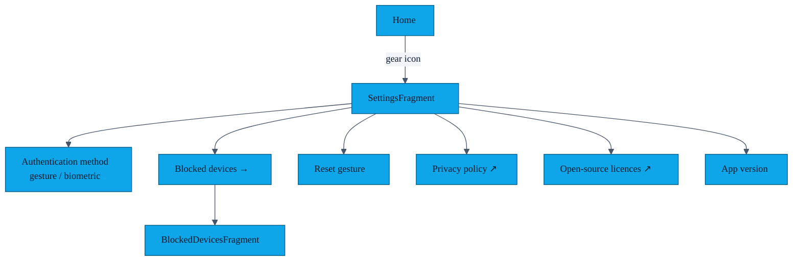

# PR-19 — Settings + Blocked Devices screens

> All app-wide preferences live on one screen, and the blocklist gets its own list-view so users can undo a hasty block.

---

## Settings information architecture

The Settings screen reads/writes `AuthPreferences` (DataStore). The blocked-devices screen reads `BlockedEndpointDao.getAll()` as a `Flow<List<BlockedEndpoint>>`.

---

## Implementation

| File | Role |
|---|---|
| `ui/settings/SettingsFragment.kt` | Layout binding, switches, click handlers |
| `ui/settings/SettingsViewModel.kt` | Exposes a `StateFlow<SettingsUiState>` |
| `ui/settings/BlockedDevicesFragment.kt` | RecyclerView list of blocked peers |
| `ui/settings/BlockedDevicesAdapter.kt` | `ListAdapter<BlockedEndpoint, _>` with stable IDs |
| `ui/settings/BlockedDevicesViewModel.kt` | Wraps `BlocklistRepository` flow |

---

## UX details

- The "Reset gesture" action is destructive — confirmed by a `MaterialAlertDialog`.
- The blocked-devices list shows the name snapshot AND the relative date ("blocked 3 days ago") so users can recall context.
- Tap to unblock is one-shot; an in-line "Undo" snackbar gives the user 4 s to revert.

---

## Tests

Manual QA. The DAO behind both screens is covered by `BlockedEndpointDaoTest` (instrumentation, see [`features/14-blocklist.md`](14-blocklist.md)).
