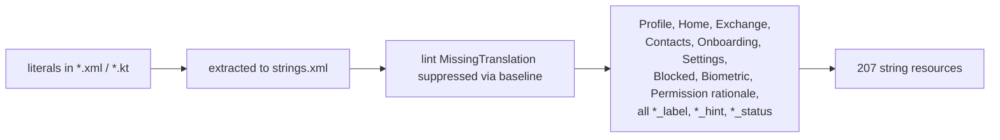

# PR-20 — Localisation scaffolding

> PR-20a / PR-20b / PR-20c together extract **every** user-visible literal from layouts and Kotlin into `app/src/main/res/values/strings.xml`. This is the *prerequisite* step; the **translated** resource bundles are not in the repo yet.

---

## Status

🟡 **Partial.** The README and `STORE_LISTING.md` advertise eight supported languages, but only the English source is committed:

```
app/src/main/res/values/strings.xml          ← committed ✅
app/src/main/res/values-hi/strings.xml       ← TODO
app/src/main/res/values-es/strings.xml       ← TODO
app/src/main/res/values-fr/strings.xml       ← TODO
app/src/main/res/values-de/strings.xml       ← TODO
app/src/main/res/values-ja/strings.xml       ← TODO
app/src/main/res/values-ko/strings.xml       ← TODO
app/src/main/res/values-zh-rCN/strings.xml   ← TODO
```

This is called out in [`AUDIT.md`](../AUDIT.md) as the highest-priority pre-launch follow-up.

---

## What PR-20 actually delivered



The string IDs are stable and grouped by screen so translators see related strings together.

---

## How to add a translation

1. Create `app/src/main/res/values-XX/strings.xml` (where `XX` is the locale, e.g. `hi`, `es`, `zh-rCN`).
2. Copy every `<string name="...">` from the default file (omit `<string name="...">` entries that contain only `\u00A0`-style escapes).
3. Translate the *content*, leave the format specifiers (`%1$d`, `%1$s`) and the inline `\u…` escapes alone.
4. Run `./gradlew lintDebug` — the `MissingTranslation` baseline will narrow as you add entries.
5. Test by switching the device locale and re-launching.

---

## Why the current build still ships

Android falls back to `values/` for any locale that does not have its own bundle. A user whose device is set to Hindi today will see English copy; the app does not crash and does not look broken — it just isn't yet a localised experience.

---

## Tests

n/a — translation is a content task, not a code task. Linting (`lintDebug`) is the gate.
