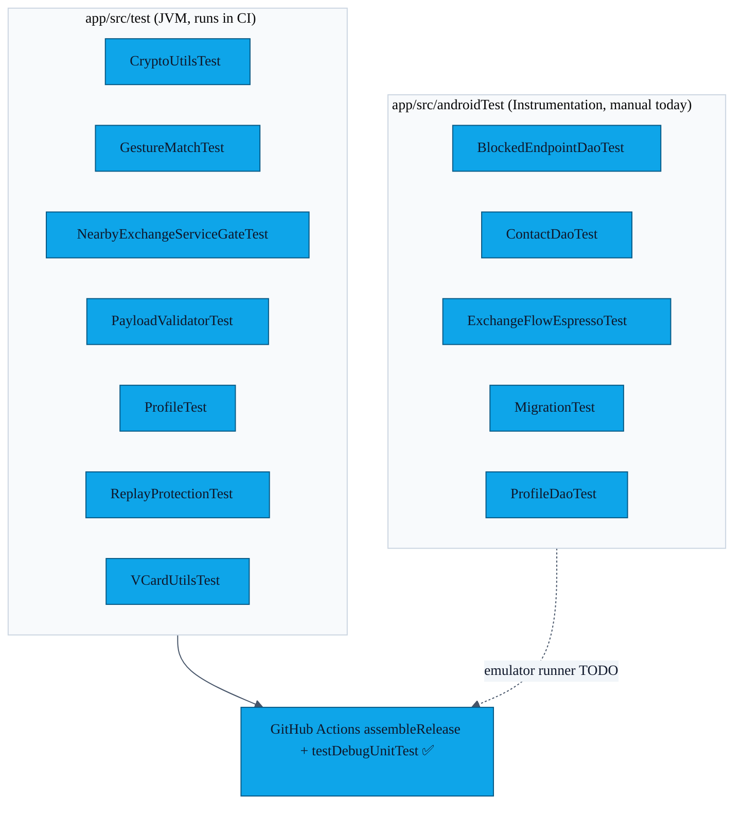

# PR-21 — Test-suite finisher

> PR-21 brought the existing test suite to a uniform state: every feature that lands in `main` has either a JVM unit test or a Room/Espresso instrumentation test backing it. CI runs the JVM suite on every PR; the instrumentation tests run locally for now (see [`AUDIT.md`](../AUDIT.md)).

---

## Test inventory



---

## What the JVM tests cover

| File | Surface area |
|---|---|
| `CryptoUtilsTest` | ECDH agree, AES-GCM round-trip, tampered-tag failure |
| `GestureMatchTest` | DTW correctness, variance gate, threshold edges |
| `NearbyExchangeServiceGateTest` | Service refuses to start without a verified gesture; race-fix from PR-02 |
| `PayloadValidatorTest` | Allowed schema, size limits, embedded-HTML rejection |
| `ProfileTest` | Profile field defaults + share-toggle behaviour |
| `ReplayProtectionTest` | Strictly-greater counter rule, AES-GCM tag failure, per-peer independence |
| `VCardUtilsTest` | Required fields, optional skips, UTF-8, newlines escaped |

---

## What the instrumentation tests cover

| File | Surface area |
|---|---|
| `BlockedEndpointDaoTest` | Insert/delete/isBlocked, flow emissions |
| `ContactDaoTest` | CRUD, search, favourite/notes, sort order |
| `ExchangeFlowEspressoTest` | End-to-end happy-path UI walk (mocked Nearby) |
| `MigrationTest` | `1 → 2` migration against the committed schema JSON |
| `ProfileDaoTest` | Singleton upsert behaviour |

---

## Running locally

```bash
# All JVM tests:
./gradlew testDebugUnitTest

# All instrumentation (needs a connected device or running emulator):
./gradlew connectedAndroidTest
```

---

## Following up

The single biggest gap is the missing **CI emulator job** for the five instrumentation tests. A `reactivecircus/android-emulator-runner@v2` step would solve this; it is tracked at the bottom of [`AUDIT.md`](../AUDIT.md) and in the inline comment of [`.github/workflows/ci.yml`](../../.github/workflows/ci.yml).
